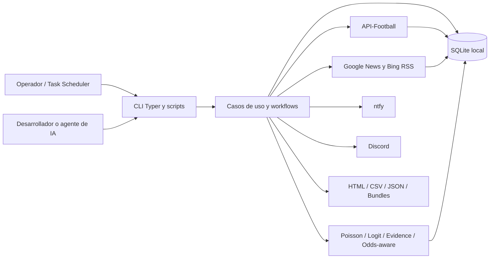
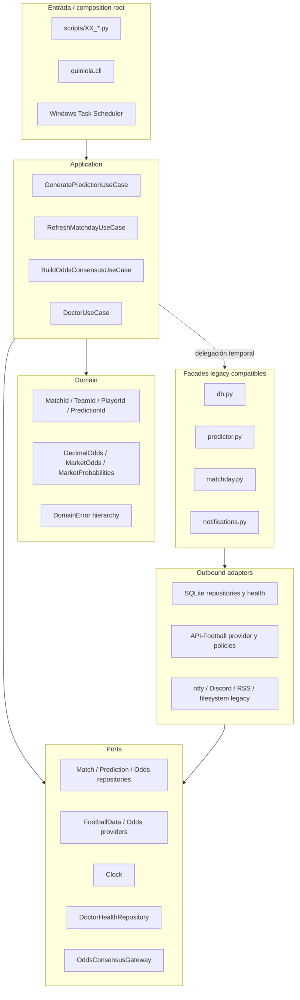
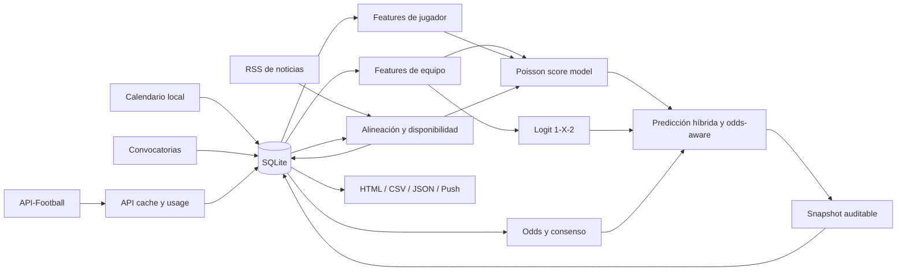
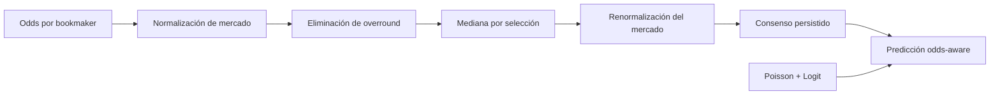
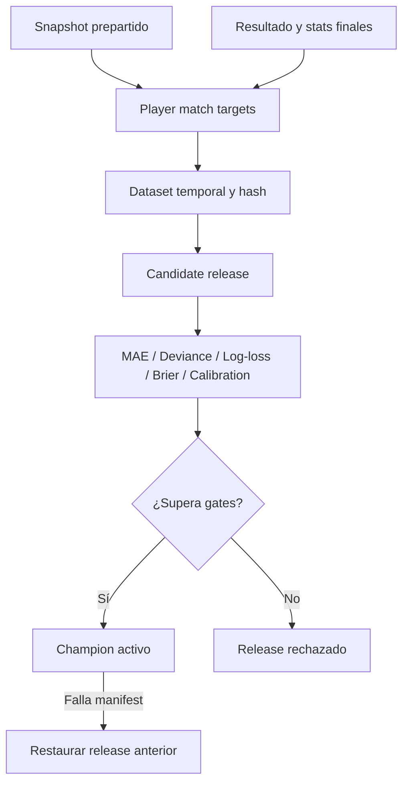
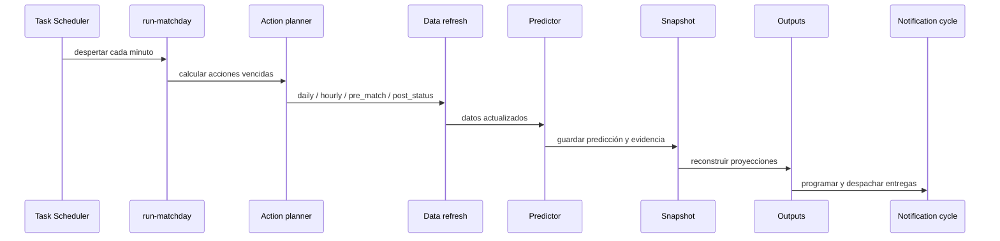
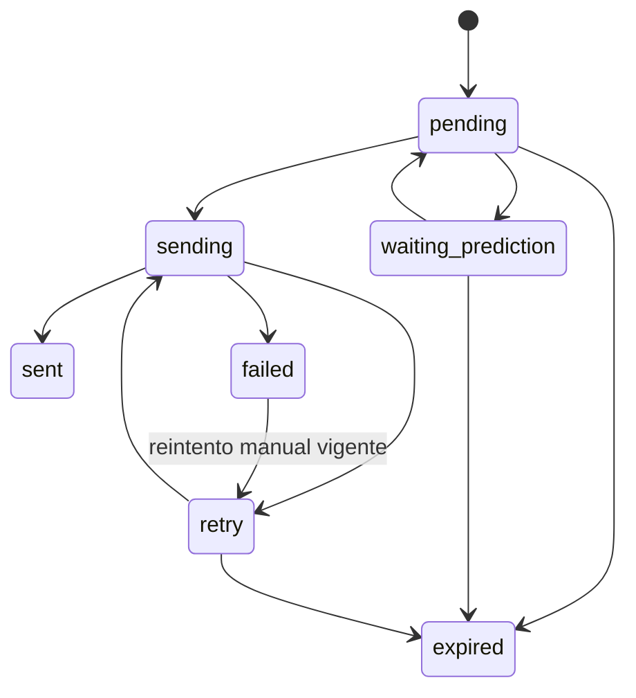
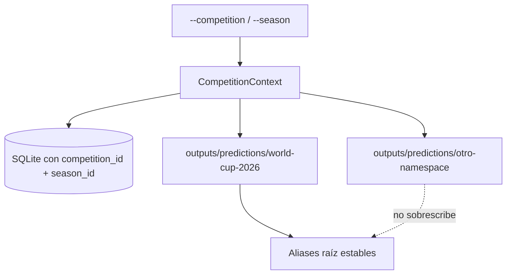

# Quiniela Mundial 2026

Pronosticador de fútbol local-first, auditable y multi-competencia para estimar
marcadores exactos, probabilidades `1-X-2`, impacto de alineaciones y señales de
mercado. La V1 conserva el Mundial 2026 como experiencia predeterminada y añade
una arquitectura hexagonal incremental, operación automatizada, aprendizaje
controlado, notificaciones robustas y aislamiento por competencia/temporada.

> **Estado:** V1 solidificada. El backlog de solidificación `TASK-000` a
> `TASK-041` está cerrado y la suite offline registra 156 tests.

## Contenido

- [Resumen corporativo](#resumen-corporativo)
- [Qué integra la V1](#qué-integra-la-v1)
- [Estado de implementación](#estado-de-implementación)
- [Arquitectura del sistema](#arquitectura-del-sistema)
- [Pipeline de datos y predicción](#pipeline-de-datos-y-predicción)
- [Modelos y auditabilidad](#modelos-y-auditabilidad)
- [Operación matchday](#operación-matchday)
- [Notificaciones](#notificaciones)
- [Multi-competencia](#multi-competencia)
- [Base de datos](#base-de-datos)
- [Instalación y onboarding](#instalación-y-onboarding)
- [CLI y scripts](#cli-y-scripts)
- [Workflows operativos](#workflows-operativos)
- [Outputs y bundle público](#outputs-y-bundle-público)
- [Testing y quality gates](#testing-y-quality-gates)
- [Agentes de IA](#agentes-de-ia)
- [Migración a otros torneos](#migración-a-otros-torneos)
- [Contribuciones](#contribuciones)
- [Seguridad, datos y licencias](#seguridad-datos-y-licencias)
- [Documentación técnica](#documentación-técnica)

## Resumen corporativo

### Problema

Una predicción deportiva operativa no consiste únicamente en calcular un
marcador. También debe resolver:

- qué datos estaban disponibles antes del kickoff;
- si las alineaciones eran oficiales, estimadas o desconocidas;
- cuánto influyeron los jugadores, el mercado y la forma reciente;
- qué modelo y release produjo el resultado;
- si la predicción puede evaluarse de forma justa;
- cómo actualizar datos y avisar al usuario sin duplicar trabajo;
- cómo operar con una API limitada, interrupciones de red y datos incompletos.

### Solución

Quiniela Mundial 2026 mantiene una fuente operativa SQLite local, consume
API-Football con políticas de caché y cuota, combina modelos estadísticos con
evidencia de jugadores y odds, captura snapshots prepartido y publica resultados
en HTML, CSV, JSON y notificaciones.

El sistema está diseñado para continuar funcionando de manera degradada cuando
faltan datos externos. La trazabilidad se conserva en la base, los outputs y los
reportes, de modo que una persona pueda explicar por qué cambió una predicción.

### Valor de la V1

- **Local-first:** la base SQLite es la fuente operativa.
- **Auditable:** cada predicción conserva contexto, freshness, release y razones
  de degradación.
- **Automatizable:** Task Scheduler despierta workflows idempotentes.
- **Resiliente:** caché, presupuestos, reintentos y modos degradados.
- **Odds-aware:** el mercado complementa, no sustituye, los modelos internos.
- **Player-aware:** alineaciones y evidencia individual alteran las features.
- **Multi-competencia:** datos y outputs se aíslan por competition/season.
- **Agent-ready:** backlog, handoffs, contratos y gates permiten continuidad
  segura entre desarrolladores y agentes de IA.

### Audiencia

- operadores que ejecutan el pronosticador en Windows;
- analistas que inspeccionan predicciones y métricas;
- desarrolladores que extienden adapters, casos de uso o modelos;
- equipos que quieren migrar el sistema a otra competencia;
- agentes de IA que trabajan con tareas acotadas y evidencia verificable.

## Qué integra la V1

### Producto y predicción

- Predicción exacta mediante matriz Poisson.
- Probabilidades de resultado `1-X-2` mediante modelo Logit.
- Ajuste por forma reciente, ratings y localía.
- Features individuales de jugadores y agregados por alineación.
- Once oficial, estimado por noticias, reciente o inferido por uso histórico.
- Odds normalizadas, de-vig por bookmaker, consenso y ajuste odds-aware.
- Outputs humanos con Poisson, híbrido, odds-aware, freshness y degradaciones.

### Datos y operación

- Calendario y convocatorias desde fuentes locales.
- Backfill histórico y refresh del día mediante API-Football.
- Caché local, registro de cuota, reintentos y clasificación de errores.
- Ventanas `T-60`, `T-30`, `T-15`, `T-5` y `T-1`.
- Sondeo postpartido desde `T+105`, cada 15 minutos, hasta `T+360`.
- Automatización idempotente mediante `automation_runs`.
- Doctor CLI read-only para revisar entorno, DB, outputs, outbox y release.

### Aprendizaje controlado

- Snapshots prepartido inmutables.
- Targets posteriores al partido.
- Evaluación temporal sin mezclar futuro con entrenamiento.
- Champion/challenger para releases de evidencia de jugadores.
- Gates de MAE, devianza Poisson, log-loss, Brier y calibración.
- Rollback al release anterior si falla la activación.

### Canales y publicación

- Notificaciones ntfy.
- Notificaciones Discord por webhook.
- Outbox persistente con deduplicación, expiración y reintentos.
- HTML, CSV y JSON estables.
- Outputs namespaced por competencia.
- Bundle público sanitizado para bootstrap offline.
- Política explícita: outputs, DB, modelos y secretos no se versionan.

## Estado de implementación

| Superficie | Estado V1 | Nota |
| --- | --- | --- |
| Mundial 2026 | Implementado y default | Conserva aliases estables. |
| Arquitectura hexagonal | Implementada incrementalmente | Convive con facades legacy. |
| SQLite multi-competencia | Implementado | Tablas operativas usan competition/season. |
| CLI multi-competencia | Implementado | `--competition` y `--season`. |
| Champions League | Config de ejemplo | API y parsers deshabilitados. |
| Liga MX | Config de ejemplo | No ejecutar live sin adapters/datos. |
| Poisson + Logit | Implementado | Componentes canónicos actuales. |
| Odds-aware | Implementado como señal auxiliar | No reemplaza el modelo interno. |
| Evidence releases | Implementado | Gates y activación controlada. |
| ntfy y Discord | Implementado, apagado por default | Requiere secretos locales. |
| Bundle público | Implementado | Sanitizado, no implica licencia. |
| Quality gates | Implementados gradualmente | Pytest, Ruff, mypy, pre-commit. |

### Compatibilidad legacy

La migración no reescribió el sistema completo. Los módulos planos
`db.py`, `predictor.py`, `matchday.py`, `notifications.py`,
`historical_loader.py` y otros continúan funcionando como facades o workflows
compatibles. El código nuevo introduce contratos alrededor de ellos y desplaza
dependencias concretas de forma gradual.

Esto es deliberado:

- protege los scripts existentes;
- evita migraciones destructivas;
- permite rollback por task;
- reduce el riesgo de mover módulos grandes de una sola vez.

## Arquitectura del sistema

### Contexto general



### Arquitectura hexagonal incremental



### Dirección de dependencias

Reglas protegidas por tests de arquitectura:

- `domain` no importa adapters, infraestructura, SQLite, HTTP ni UI.
- `ports` no importa adapters ni el facade `db.py`.
- `application` no importa SQLite, requests, Typer, Rich ni providers
  concretos.
- adapters implementan puertos y conocen tecnologías externas.
- CLI funciona como composition root y construye dependencias concretas.
- el legacy plano queda fuera del guardrail inicial, pero no debe contaminar
  código hexagonal nuevo.

### Paquetes V1

| Paquete | Responsabilidad |
| --- | --- |
| `domain/` | Value objects, errores y lógica pura de odds. |
| `application/` | Comandos, resultados y casos de uso. |
| `ports/` | Protocols para repositorios, providers, clock y health. |
| `adapters/` | Implementaciones SQLite y API-Football. |
| `infrastructure/` | Clock del sistema y configuración de competencia. |
| módulos legacy | Workflows completos conservados durante la migración. |

### Casos de uso explícitos

- `GeneratePredictionUseCase`: genera por fecha o por partido delegando al
  predictor compatible.
- `RefreshMatchdayUseCase`: ejecuta el workflow de jornada mediante una facade
  inyectable.
- `BuildOddsConsensusUseCase`: consume `OddsConsensusGateway` sin conocer
  SQLite.
- `DoctorUseCase`: inspecciona salud mediante `DoctorHealthRepository` y
  produce salidas human, JSON o Markdown.

Los detalles normativos están en:

- [Architecture Target](docs/ARCHITECTURE_TARGET.md)
- [Hexagonal Migration Plan](docs/HEXAGONAL_MIGRATION_PLAN.md)
- [Coding Standards](docs/CODING_STANDARDS.md)
- [Architecture Audit](docs/ARCHITECTURE_AUDIT.md)

## Pipeline de datos y predicción



### Fuentes

1. **Locales:** calendario, convocatorias y configuraciones YAML.
2. **API-Football:** fixtures, lineups, estadísticas, eventos, jugadores y
   odds.
3. **RSS:** noticias recientes para fallback de alineación.
4. **SQLite:** histórico, caché, predicciones, evaluaciones y releases.

### Modos de refresh

| Modo | Uso |
| --- | --- |
| `full` | Carga amplia de fixtures, lineups, eventos, stats, jugadores y odds. |
| `hourly` | Refresh ligero durante el día. |
| `pre_match` | Datos cercanos al kickoff, lineups, odds y fallback. |
| `post_status` | Sondeo de estado y resultado posterior al partido. |
| `lineups` | Sólo alineaciones. |

### Política API

El cliente y los adapters aplican:

- cache-first;
- registro de cache hits y llamadas live;
- límite diario configurable;
- reserva crítica de cuota;
- presupuestos por endpoint/modo;
- retry para fallos transitorios;
- bloqueo ante cuota agotada o `429`;
- circuit breaker y decisiones de policy en adapters nuevos;
- degradación segura si falta API key;
- `--dry-run` sin tráfico live;
- `--force-refresh` sólo para operación consciente.

La especificación completa vive en [API Policy](docs/API_POLICY.md). Consulta
precios y términos actuales únicamente en los sitios oficiales:

- [API-Football pricing](https://www.api-football.com/pricing)
- [API-Football terms](https://www.api-football.com/terms)

## Modelos y auditabilidad

### Poisson para marcador exacto

El componente Poisson estima:

- `lambda_home`;
- `lambda_away`;
- distribución de goles por equipo;
- matriz de resultados exactos;
- score y probabilidad más probable.

Las features combinan forma, ratings, goles recientes, localía y agregados de
alineación. El marcador exacto sigue siendo la salida principal del producto.

### Logit para `1-X-2`

Un modelo Logit estima victoria local, empate y victoria visitante. Sus
probabilidades se usan como señal complementaria y como referencia de
calibración frente al componente Poisson.

### Evidencia de jugadores

Los datos individuales se convierten en señales de:

- ataque;
- creación;
- defensa;
- portería;
- disciplina;
- disponibilidad;
- titularidad y minutos recientes.

Después se agregan por equipo:

- fuerza ofensiva del once;
- fuerza defensiva;
- control de mediocampo;
- calidad del portero;
- impacto del banco;
- penalización disciplinaria.

La fuente de alineación queda registrada como oficial, estimada por noticias,
reciente o inferida.

### Odds-aware



La V1:

- almacena snapshots normalizados;
- calcula probabilidades justas por bookmaker;
- obtiene consenso robusto;
- registra freshness y coverage;
- usa el mercado como ajuste auxiliar;
- conserva Poisson, Logit y odds-aware por separado para comparación.

El diseño completo está en
[Odds-Aware Model Design](docs/ODDS_AWARE_MODEL_DESIGN.md).

### Contrato auditable de predicción

Las predicciones pueden conservar:

- `competition_id` y `season_id`;
- contexto y ventana de generación;
- timestamp UTC y condición pre-kickoff;
- snapshot asociado;
- fuentes de alineación;
- fuente y freshness de odds;
- release/model version;
- razones de degradación;
- motivo de no evaluación;
- probabilidades y componentes del ensemble.

El contrato canónico está en [Data Contracts](docs/DATA_CONTRACTS.md).

## Aprendizaje continuo



### Niveles

1. **Actualización operacional:** resultados, ratings, cache y outputs.
2. **Champion/challenger:** entrenamiento de evidencia con gates estrictos.
3. **Evolución controlada:** ensemble, calibración y modelos por competencia.

### Elegibilidad y gates

Un partido de evidencia requiere snapshot previo, resultado, alineaciones
compatibles y estadísticas suficientes. El candidato:

- no debe empeorar métricas principales;
- debe mejorar al menos 2% la devianza o el log-loss;
- no sustituye automáticamente al champion si es rechazado;
- conserva metadata, hash, modelos y reporte para auditoría.

Cada release debe documentarse con
[Model Card Template](docs/MODEL_CARD_TEMPLATE.md).

## Operación matchday



### Acciones

- `daily`: refresh amplio una vez por fecha.
- `hourly`: actualización general por hora.
- `pre_match`: ventanas `T-60`, `T-30`, `T-15`, `T-5`, `T-1`.
- `post_match`: sondeo desde `T+105` hasta `T+360`.

Cada acción usa un `run_key` y se reclama en `automation_runs`. Repetir el
comando no debe duplicar trabajo ya completado.

### Task Scheduler

Hay dos tareas:

- **Matchday:** workflow pesado de datos, predicción y outputs.
- **Notifications:** ciclo rápido de outbox y despacho.

Los instaladores prefieren `.\.venv\Scripts\python.exe` y soportan `-DryRun`.

## Notificaciones

### Canales

- **ntfy:** publicación HTTP a un topic privado.
- **Discord:** webhook hacia un canal configurado.

Ambos están desactivados por default.

### Tipos

- predicción de ventana prepartido;
- alineación oficial detectada;
- prueba aislada de canal o lineup.

### Outbox



La entrega registra:

- clave de deduplicación;
- hash de payload;
- tipo, canal, competencia y temporada;
- kickoff y expiración;
- intentos y próximo retry;
- error normalizado y status HTTP;
- timestamps de envío.

Los errores `408`, `429`, `5xx` y de red son retryable. Ningún retry debe
cruzar el kickoff o su `expires_at`. Consulta el contrato completo en
[Notification Contracts](docs/NOTIFICATION_CONTRACTS.md).

## Multi-competencia

### Contexto

`CompetitionContext` concentra:

- `competition_id`;
- `season_id`;
- namespace;
- configuración YAML;
- política de aliases;
- fuentes y parámetros de API.

Los comandos relevantes aceptan:

```powershell
--competition world_cup_2026
--season world_cup_2026
```

`--competition` puede ser el nombre de un YAML en `configs/competitions/` o una
ruta explícita. `--season` valida la temporada del archivo seleccionado.

### Aislamiento



- Mundial 2026 es el default.
- Sólo el default puede escribir aliases raíz.
- Competencias no default escriben en su namespace.
- Queries y entregas nuevas filtran competition/season.
- Configs con API deshabilitada bloquean fetch live.
- Parsers no implementados fallan de forma explícita.

### Configuraciones incluidas

| Config | Estado |
| --- | --- |
| `world_cup_2026.yaml` | Operativa y default. |
| `champions_league_2026_2027.yaml` | Ejemplo; API deshabilitada. |
| `liga_mx_apertura_2026.yaml` | Ejemplo; no productiva. |

Para habilitar otra competencia sigue
[Agent Tournament Migration](docs/AGENT_TOURNAMENT_MIGRATION.md) y
[Multi-Tournament Design](docs/MULTI_TOURNAMENT_DESIGN.md).

## Base de datos

SQLite vive por default en `data/db/quiniela.db`. El schema es idempotente,
aplica migraciones compatibles y configura `busy_timeout`.

### Catálogo y torneo

- `competitions`
- `seasons`
- `competition_participants`
- `teams`
- `players`
- `matches`

### API, datos históricos y live

- `api_cache`
- `api_usage`
- `historical_matches`
- `historical_lineups`
- `lineup_estimates`
- `historical_team_stats`
- `historical_player_stats`
- `fixture_player_stats`
- `player_season_stats`

### Mercado y predicción

- `odds_snapshots`
- `odds_market_snapshots`
- `odds_market_consensus`
- `odds_model_predictions`
- `predictions`
- `prediction_player_impacts`
- `prediction_evaluations`
- `actual_results`

### Automatización y notificaciones

- `automation_runs`
- `notification_deliveries`

### Evidencia y releases

- `pre_match_snapshots`
- `pre_match_player_snapshots`
- `player_match_targets`
- `player_evidence_evaluations`
- `player_prediction_evaluations`
- `model_training_runs`
- `model_releases`

### Principios de persistencia

- migraciones aditivas e idempotentes;
- índices por match, fixture, season y estado;
- `INSERT OR IGNORE` y `ON CONFLICT` donde aplica;
- timestamps y source JSON para trazabilidad;
- DB real fuera de Git;
- DB temporal en tests.

## Instalación y onboarding

### Requisitos

- Windows con PowerShell para la automatización oficial;
- Python 3.11 o superior;
- conexión a Internet sólo para operaciones live;
- API key de API-Football para datos externos;
- SQLite incluido con Python.

### Crear el entorno

```powershell
py -3.11 --version
py -3.11 -m venv .venv
Set-ExecutionPolicy -Scope Process Bypass
.\.venv\Scripts\Activate.ps1
python --version
python -m pip install -r requirements.txt
python -m pip install -e .
python -m pip check
```

Si el launcher `py` todavía no detecta una instalación por usuario:

```powershell
& "$env:LOCALAPPDATA\Programs\Python\Python311\python.exe" -m venv .venv
```

### Configurar el entorno

```powershell
Copy-Item .env.example .env
```

Completa `.env` localmente. Nunca lo compartas ni lo pegues en un handoff.

Variables principales:

| Variable | Propósito |
| --- | --- |
| `API_FOOTBALL_KEY` | Credencial de API-Football. |
| `API_DAILY_LIMIT` | Límite live configurado. |
| `API_CRITICAL_RESERVE` | Cuota reservada para ventanas críticas. |
| `DB_PATH` | Ruta de SQLite. |
| `LOCAL_TIMEZONE` | Zona operativa. |
| `WEB_LINEUP_FALLBACK_*` | Límites del fallback RSS. |
| `NOTIFICATIONS_ENABLED` | Interruptor global de notificaciones. |
| `NTFY_*` | Configuración del canal ntfy. |
| `DISCORD_*` | Configuración del webhook Discord. |

### Verificar instalación

```powershell
python -m quiniela.cli --help
python -m quiniela.cli doctor
python -m quiniela.cli doctor --format json
pytest -q
```

El doctor es read-only: no consume API, no repara la DB y no imprime secretos.

### Inicializar

```powershell
python scripts\01_ingest_calendar.py
python scripts\02_ingest_rosters.py
python scripts\03_init_db.py
python scripts\22_rebuild_outputs.py
```

## CLI y scripts

Los scripts Python son wrappers del CLI Typer. Puedes usar:

```powershell
python scripts\05_fetch_today_data.py --help
python -m quiniela.cli fetch-today --help
```

### Ingesta, datos y predicción

| Script | Comando CLI | Propósito |
| --- | --- | --- |
| `01_ingest_calendar.py` | `ingest-calendar` | Procesar calendario local. |
| `02_ingest_rosters.py` | `ingest-rosters` | Procesar convocatorias. |
| `03_init_db.py` | `init-db` | Crear schema y sembrar datos. |
| `04_fetch_priority_history.py` | `fetch-history` | Backfill histórico por equipos. |
| `05_fetch_today_data.py` | `fetch-today` | Refresh por fecha y modo. |
| `06_predict_match.py` | `predict` | Predecir fecha o partido. |
| `07_update_after_match.py` | `update-after-match` | Sincronizar resultado y recalcular. |
| `08_report_api_usage.py` | `report-api-usage` | Revisar consumo y cache. |

### Publicación y outputs

| Script | Comando CLI | Propósito |
| --- | --- | --- |
| `09_export_public_bundle.py` | `export-public-bundle` | Crear bundle sanitizado. |
| `10_import_public_bundle.py` | `import-public-bundle` | Importar bundle offline. |
| `11_public_bundle_status.py` | `public-bundle-status` | Revisar estado del bundle. |
| `12_render_html_report.py` | `render-html-report` | Renderizar HTML para fechas. |
| `22_rebuild_outputs.py` | `rebuild-outputs` | Reconstruir outputs estables. |
| `23_evaluate_predictions.py` | `evaluate-predictions` | Evaluar predicciones finalizadas. |
| `24_cleanup_obsolete_outputs.py` | `cleanup-obsolete-outputs` | Limpiar con dry-run/apply. |

### Modelos y evidencia

| Script | Comando CLI | Propósito |
| --- | --- | --- |
| `13_train_player_model.py` | `train-player-model` | Entrenar modelo de jugador v1. |
| `14_train_outcome_model.py` | `train-outcome-model` | Entrenar Logit `1-X-2`. |
| `16_capture_pre_match_snapshot.py` | `capture-pre-match-snapshot` | Guardar snapshot. |
| `17_build_player_targets.py` | `build-player-targets` | Construir targets finales. |
| `18_train_player_evidence.py` | `train-player-evidence` | Entrenar candidate release. |
| `19_evaluate_model_release.py` | `evaluate-model-release` | Inspeccionar release. |
| `20_activate_model_release.py` | `activate-model-release` | Activar candidate aprobado. |

### Automatización, odds y notificaciones

| Script | Comando CLI | Propósito |
| --- | --- | --- |
| `15_run_matchday.py` | `run-matchday` | Ejecutar jornada idempotente. |
| `21_fetch_web_lineup_fallback.py` | `fetch-web-lineup-fallback` | Refrescar once estimado. |
| `25_dispatch_notifications.py` | `dispatch-notifications` | Despachar outbox. |
| `26_test_notifications.py` | `test-notifications` | Probar canales configurados. |
| `27_run_notification_cycle.py` | `run-notification-cycle` | Programar y despachar. |
| `28_recover_automation_runs.py` | `recover-automation-runs` | Recuperar runs stale. |
| `29_fetch_odds.py` | `fetch-odds` | Obtener odds por fecha. |
| `30_build_odds_consensus.py` | `build-odds-consensus` | Construir consenso. |
| `31_send_lineup_test_notifications.py` | `send-lineup-test-notifications` | Probar push de lineup. |
| `33_run_notification_watchdog.py` | `notification-watchdog` | Watchdog liviano de outbox. |

### Comandos operativos adicionales

Estos comandos no tienen wrapper numérico dedicado:

- `doctor`
- `notifications-status`
- `retry-failed-notifications`
- `dry-run-notifications`
- `explain-notification`

## Workflows operativos

### Bootstrap offline

```powershell
python scripts\01_ingest_calendar.py
python scripts\02_ingest_rosters.py
python scripts\03_init_db.py
python scripts\06_predict_match.py --date 2026-06-11
python scripts\22_rebuild_outputs.py
```

### Refresh seguro

```powershell
python scripts\05_fetch_today_data.py --date 2026-06-11 --dry-run
python scripts\05_fetch_today_data.py --date 2026-06-11 --mode hourly
python scripts\05_fetch_today_data.py --date 2026-06-11 --mode pre_match
```

Evita `--force-refresh` sin revisar cuota y necesidad.

### Matchday manual

```powershell
python scripts\15_run_matchday.py
python scripts\15_run_matchday.py --now 2026-06-13T12:59:00-06:00
python -m quiniela.cli notifications-status
```

### Watchdog de notificaciones

El watchdog es la ruta primaria para despachar el outbox. Corre trabajo liviano:
programa ventanas vencidas, recupera fallos recuperables, despacha pendientes y
registra salud sin refrescar API, predicciones ni HTML.

```powershell
python -m quiniela.cli notification-watchdog --dry-run
python -m quiniela.cli notification-watchdog
powershell -NoProfile -ExecutionPolicy Bypass -File .\scripts\install_notification_watchdog_task.ps1 -DryRun
powershell -NoProfile -ExecutionPolicy Bypass -File .\scripts\install_notification_watchdog_task.ps1
```

La tarea `Quiniela Mundial 2026 Notification Watchdog` corre cada 2 minutos con
lock propio y `--skip-if-lock-busy`. Sus artefactos principales son
`outputs/logs/notification_watchdog_runs.jsonl`,
`outputs/logs/notification_health.json`,
`outputs/logs/scheduler_skips.jsonl` y
`outputs/logs/notification_watchdog_errors.log`.

### Instalar automatización

```powershell
powershell -NoProfile -ExecutionPolicy Bypass -File .\scripts\install_wake_scheduler.ps1 -DryRun
powershell -NoProfile -ExecutionPolicy Bypass -File .\scripts\install_wake_scheduler.ps1
```

El instalador elimina el polling cada minuto. Un planner diario y de inicio de
sesion crea tareas one-shot agrupadas por timestamp para T-60, T-30, T-15, T-5,
T-1 y los sondeos postpartido T+105..T+360 cada 15 minutos.

Todas usan `WakeToRun`, `StartWhenAvailable` y `pythonw.exe`, sin consola ni
cambio de foco. El planner conserva un horizonte movil de tres dias y escribe
`outputs/logs/wake_schedule.json`. Los wake timers se habilitan para corriente
alterna; el equipo debe permanecer conectado para una operacion confiable.
Despues de cada tarea, Windows vuelve a aplicar su politica normal de
suspension y el proyecto nunca fuerza el reposo si el usuario esta trabajando.

Para ejecutar manualmente un ciclo visible en el monitor `DELL P2219H`:

```powershell
powershell -NoProfile -ExecutionPolicy Bypass -File .\scripts\run_scheduled_python.ps1 -PythonPath .\.venv\Scripts\python.exe -ScriptPath .\scripts\15_run_matchday.py -MonitorName "DELL P2219H"
powershell -NoProfile -ExecutionPolicy Bypass -File .\scripts\run_scheduled_python.ps1 -PythonPath .\.venv\Scripts\python.exe -ScriptPath .\scripts\27_run_notification_cycle.py -MonitorName "DELL P2219H"
```

Las tareas usan logon interactivo: se ejecutan mientras la sesion del usuario
que las instalo permanezca iniciada, aunque la pantalla este bloqueada. Si el
usuario cierra sesion, Windows no mantiene disponible ese escritorio
interactivo y las tareas esperan al siguiente inicio de sesion.

Para eliminar la tarea matchday:

```powershell
powershell -NoProfile -ExecutionPolicy Bypass -File .\scripts\uninstall_wake_scheduler.ps1
```

### Diagnóstico

```powershell
python -m quiniela.cli doctor
python -m quiniela.cli doctor --format markdown
python -m quiniela.cli notifications-status
python -m quiniela.cli dry-run-notifications
python -m quiniela.cli retry-failed-notifications --dry-run
```

Consulta:

- [Runbook de operación](docs/RUNBOOK_OPERACION.md)
- [Runbook de incidentes](docs/RUNBOOK_INCIDENTES.md)

## Outputs y bundle público

### Outputs

El sistema genera:

- `predictions_latest.csv/json`;
- `predictions_history.csv/json`;
- `index.html`;
- `today.html`;
- reportes de calidad, performance y automatización;
- bundles sanitizados.

El default conserva aliases en `outputs/predictions/` y escribe también en
`outputs/predictions/world-cup-2026/`. Otras competencias sólo usan su namespace.

### Política de repositorio

- `outputs/` completo es local y regenerable.
- `data/db/` y model artifacts son locales.
- `.env` y `.venv` nunca se versionan.
- no uses `git add -f outputs/`;
- demos y bundles se distribuyen por separado después de revisión humana.

### Bundle público

El export:

- copia la base necesaria para uso offline;
- elimina `api_cache`, `api_usage` y `notification_deliveries`;
- no incluye `.env` ni secretos;
- puede conservar partidos, jugadores, alineaciones y predicciones.

Sanitizado no significa automáticamente redistribuible. Revisa licencias antes
de compartirlo.

## Testing y quality gates

### Comandos oficiales

```powershell
pytest -q
ruff check .
mypy src\quiniela
pre-commit run --all-files
```

### Estrategia

- tests puros para dominio;
- fakes para casos de uso;
- SQLite temporal para adapters;
- fixtures sanitizados para providers;
- workflows offline para matchday, outputs y notificaciones;
- guardrails AST para imports de capas;
- coverage informativo sin `fail-under` global.

La suite no hace llamadas API reales ni envía notificaciones.

Consulta [Testing Strategy](docs/TESTING_STRATEGY.md).

## Agentes de IA

La V1 está preparada para trabajo agéntico verificable.

### Fuente de verdad

Orden de autoridad:

1. instrucciones actuales del usuario;
2. archivos y estado real del repositorio;
3. tests y salida de comandos;
4. handoffs y documentos;
5. memoria externa como contexto advisory.

### Flujo recomendado

1. Leer backlog, dependencia y handoff anterior.
2. Inspeccionar archivos y tests indicados.
3. Ejecutar baseline enfocado.
4. Hacer cambios acotados.
5. Ejecutar tests enfocados y suite amplia.
6. Registrar decisiones, errores, riesgos y rollback.
7. Crear o actualizar el handoff.

### Seguridad

Un agente no debe:

- leer o copiar `.env` sin necesidad y autorización;
- imprimir API keys, topics o webhooks;
- ejecutar backfills live o envíos reales sin aprobación;
- borrar DB, outputs o artefactos;
- asumir que memoria conversacional supera al repositorio.

La metodología completa está en
[Solidification and Harness Engineering Guide](docs/SOLIDIFICATION_AND_HARNESS_ENGINEERING_GUIDE.md).

## Migración a otros torneos

### Flujo resumido

1. Crear YAML de competencia y temporada.
2. Implementar o seleccionar parsers compatibles.
3. Preparar datos locales.
4. Inicializar scope en DB.
5. Ejecutar backfill con aprobación de cuota.
6. Generar predicciones y outputs namespaced.
7. Entrenar/evaluar modelo por competencia.
8. Probar notificaciones en dry-run.
9. Revisar licencias del bundle.
10. Cerrar cada etapa con handoff.

### Ejemplo offline

```powershell
python -m quiniela.cli doctor `
  --competition champions_league_2026_2027 `
  --season champions_league_2026_2027
```

La config de Champions League tiene API deshabilitada y parsers no
implementados. Es una plantilla de migración, no un entorno productivo.

## Contribuciones

### Antes de cambiar código

- identifica el contrato y la capa responsable;
- revisa tests de la superficie;
- evita refactors no relacionados;
- protege compatibilidad de CLI, scripts, DB y outputs;
- define rollback si cambias persistencia, modelos u operación.

### Durante el cambio

- dominio nuevo debe ser puro;
- aplicación depende de puertos;
- adapters contienen SQLite, HTTP y filesystem;
- usa migraciones aditivas;
- filtra por competition/season;
- no mezcles operaciones live con tests;
- agrega abstracciones sólo cuando reducen complejidad real.

### Antes de cerrar

```powershell
ruff check .
mypy src\quiniela
pytest -q
git diff --check
git status --short
```

Actualiza:

- contratos o runbooks afectados;
- tests;
- decision log si la decisión es transversal;
- handoff si el trabajo forma parte de una task agéntica.

### Nuevas dependencias

Una dependencia debe:

- resolver una necesidad concreta;
- ser compatible con Python 3.11;
- tener licencia revisable;
- poder instalarse de forma reproducible;
- no sustituir una API estándar suficiente;
- quedar documentada en requirements y setup.

## Seguridad, datos y licencias

- Nunca publiques `.env`, tokens, API keys, topics o webhooks.
- No publiques DB operativa, caché, telemetría de cuota ni dumps.
- Los outputs derivados pueden contener datos deportivos licenciados.
- El proveedor no concede automáticamente derechos de redistribución.
- Revisa términos del proveedor y de cualquier fuente adicional.
- Usa el bundle sanitizado sólo después de una revisión humana.
- Los ejemplos de configuración no contienen secretos.

## Documentación técnica

### Arquitectura y contratos

- [Architecture Audit](docs/ARCHITECTURE_AUDIT.md)
- [Architecture Target](docs/ARCHITECTURE_TARGET.md)
- [Hexagonal Migration Plan](docs/HEXAGONAL_MIGRATION_PLAN.md)
- [Data Contracts](docs/DATA_CONTRACTS.md)
- [Decision Log](docs/DECISION_LOG.md)

### Modelos, datos y operación

- [API Policy](docs/API_POLICY.md)
- [Odds-Aware Model Design](docs/ODDS_AWARE_MODEL_DESIGN.md)
- [Multi-Tournament Design](docs/MULTI_TOURNAMENT_DESIGN.md)
- [Model Card Template](docs/MODEL_CARD_TEMPLATE.md)
- [Notification Contracts](docs/NOTIFICATION_CONTRACTS.md)
- [Testing Strategy](docs/TESTING_STRATEGY.md)
- [Coding Standards](docs/CODING_STANDARDS.md)

### Runbooks y agentes

- [Runbook de operación](docs/RUNBOOK_OPERACION.md)
- [Runbook de incidentes](docs/RUNBOOK_INCIDENTES.md)
- [Agent Tournament Migration](docs/AGENT_TOURNAMENT_MIGRATION.md)
- [Solidification V1 Final Report](docs/SOLIDIFICATION_V1_FINAL_REPORT.md)
- [Solidification and Harness Engineering Guide](docs/SOLIDIFICATION_AND_HARNESS_ENGINEERING_GUIDE.md)
- [Handoff Template](docs/handoffs/HANDOFF_TEMPLATE.md)

## Cierre V1

La V1 no pretende ocultar el legacy: lo rodea con contratos, tests, adapters,
operación segura y evidencia. El resultado es un sistema que puede seguir
evolucionando sin perder la compatibilidad del MVP ni la capacidad de explicar
qué ocurrió en cada predicción, cada release y cada task de ingeniería.
