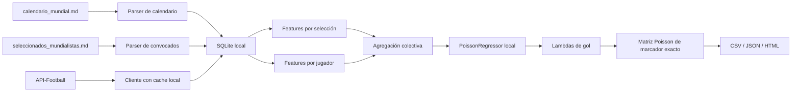
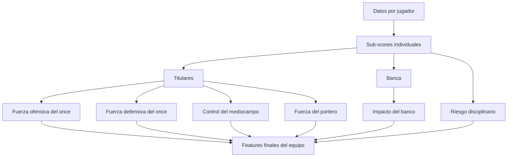
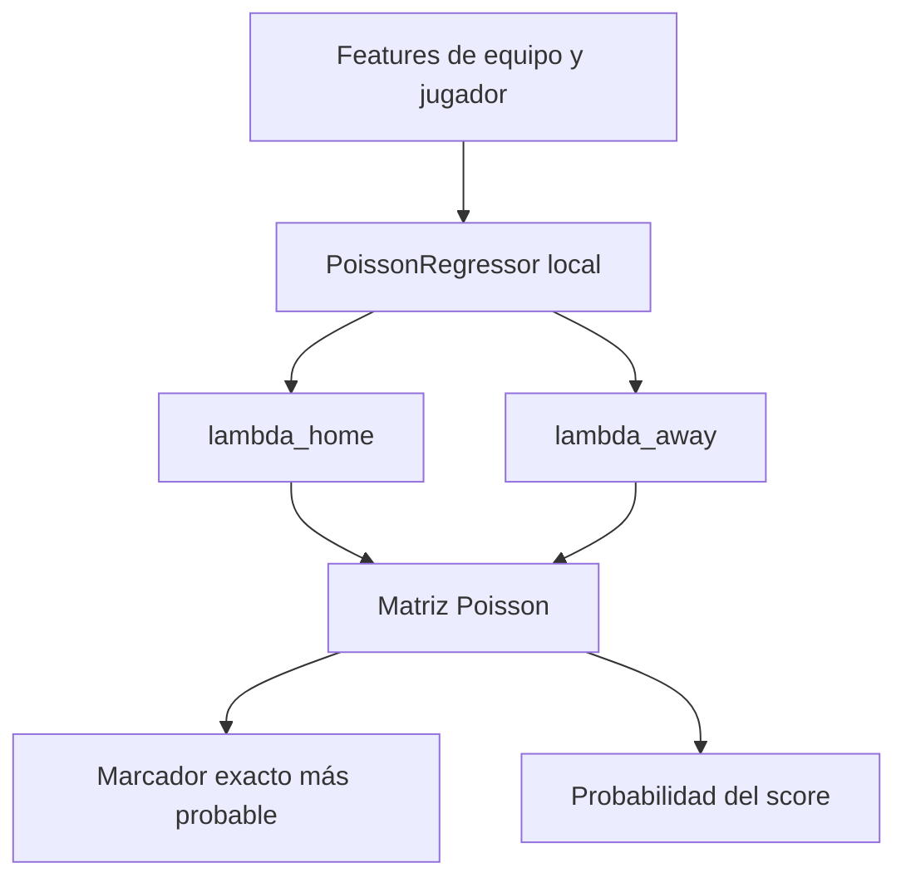

# pronosticador-mundial-2026

Pronosticador local-first en Python para estimar marcadores exactos del Mundial 2026. El proyecto combina una base SQLite, fuentes manuales, cache local de API-Football, señales colectivas por selección y señales individuales por jugador para producir predicciones reproducibles, auditables y actualizables el mismo día del partido.

## Resumen Corporativo

Esta solución toma el calendario oficial y las convocatorias iniciales, crea una base de datos local y la enriquece con información en vivo e histórica de API-Football. Con esos datos calcula la fortaleza reciente de cada selección, la calidad esperada de su alineación titular, el impacto colectivo del banco y la influencia de cada jugador en ataque, defensa, disciplina y disponibilidad. Después estima los goles esperados de local y visitante y genera un marcador exacto probable.

En términos no técnicos, el sistema responde tres preguntas:

1. Qué tan bien llega cada selección.
2. Qué tanto cambia el partido por los jugadores que sí estarán disponibles ese día.
3. Qué marcador es más consistente con ese balance total.

La solución está pensada para operar localmente:

- la base principal vive en SQLite
- la API se consulta sólo cuando hace falta
- cada respuesta útil queda cacheada
- las predicciones y reportes se exportan a archivos simples (`CSV`, `JSON`, `HTML`)

### Costos y requerimientos operativos

Requisitos mínimos:

- Python `3.11+`
- una API key de API-Football
- espacio local para SQLite y artefactos
- conectividad a internet para backfill y refresh del día

Costos de API-Football verificados el `11 de junio de 2026`:

- `Free`: `100` requests/día, `US$0/mes`
- `Pro`: `7,500` requests/día, `US$19/mes`
- `Ultra`: `75,000` requests/día, `US$29/mes`
- `Mega`: `150,000` requests/día, `US$39/mes`

Para un uso serio del proyecto, el plan recomendado es `Pro` o superior, porque:

- el backfill histórico con datos por jugador consume bastante más cuota que el modelo básico
- el plan free puede servir para pruebas ligeras y algunas alineaciones del día, pero no para poblar una base histórica rica

### Cómo influye la alineación del día

La alineación ya no se usa sólo como una confirmación binaria de “hay once confirmado”. Ahora influye así:

- titulares confirmados pesan al `100%`
- suplentes confirmados pesan al `25%`
- si no existe alineación oficial, el sistema infiere un once probable desde alineaciones recientes
- si tampoco hay alineaciones recientes, usa los jugadores con más minutos y titularidades acumuladas

Eso significa que el modelo cambia si:

- falta un delantero con alto volumen de tiro y gol
- un mediocampista clave mejora el control y progresión
- el portero titular ofrece mejor prevención de gol
- una defensa acumula mala disciplina o riesgo de roja/penal

## Qué hace el proyecto

- Ingiera calendario y convocados desde archivos Markdown.
- Normaliza selecciones y jugadores.
- Construye y mantiene una base SQLite local.
- Consulta API-Football con estrategia `cache-first`.
- Hace backfill histórico por selección.
- Descarga lineups, stats por fixture, stats por jugador y odds.
- Entrena un modelo estadístico local con señales colectivas e individuales.
- Predice marcador exacto por fecha o por partido.
- Genera `CSV`, `JSON` y `HTML` listos para inspección.

## Cómo funciona



## Cómo se calcula el resultado

### 1. Señales por selección

Para cada equipo se calcula una ventana reciente con indicadores como:

- goles a favor promedio
- goles en contra promedio
- diferencia de gol
- tasa de victoria
- porterías a cero
- forma reciente
- localía
- ajuste de mercado vía odds

Estas señales siguen siendo importantes porque describen el comportamiento colectivo reciente de una selección.

### 2. Señales por jugador

El sistema consulta y consolida dos tipos de datos individuales:

- `season prior`: lo acumulado por jugador en la temporada o competencia
- `recent form`: lo hecho por ese jugador en sus últimos partidos disponibles

Se construyen sub-scores individuales a partir de métricas reales disponibles en API-Football:

- `attack_score`
  - goles por 90
  - tiros a puerta por 90
  - asistencias por 90
  - pases clave por 90
  - regates exitosos por 90
- `defense_score`
  - tackles por 90
  - intercepciones por 90
  - porcentaje de duelos ganados
  - duelos ganados por 90
- `discipline_risk`
  - faltas cometidas por 90
  - amarillas por 90
  - rojas por 90
  - penales cometidos
- `availability_score`
  - minutos recientes
  - titularidades recientes
  - apariciones acumuladas
- `goalkeeper_score`
  - atajadas
  - goles concedidos
  - rating
  - minutos

Cuando una métrica no existe literalmente en la API, se usa un proxy explícito. Por ejemplo:

- juego aéreo: `altura + duelos ganados + posición`
- recuperación de balón: `tackles + intercepciones + duelos`

### 3. Cómo se convierten esos datos en fuerza colectiva

Los sub-scores de jugador se agregan a nivel equipo para producir:

- `starter_attack_strength`
- `starter_defense_strength`
- `starter_midfield_control`
- `goalkeeper_strength`
- `bench_impact`
- `discipline_risk_penalty`

Estos agregados se combinan con las señales tradicionales del equipo. Así, la predicción final ya no depende sólo del histórico de la selección, sino también de qué jugadores concretos llegan, juegan y con qué perfil.



### 4. Modelo estadístico

Con esas features se entrena un modelo local con dos `PoissonRegressor`:

- uno para estimar goles del local
- uno para estimar goles del visitante

El modelo aprende a transformar la combinación de señales colectivas e individuales en:

- `lambda_home`
- `lambda_away`

Luego esas lambdas alimentan una matriz Poisson `0..5 x 0..5`. Finalmente se aplica un prior ligero a marcadores muy comunes en torneos cortos y se elige el score exacto más probable.



## Arquitectura operativa

Principios del sistema:

- `local-first`: SQLite es la fuente operativa
- `cache-first`: primero se busca en `api_cache`
- `live-on-miss`: sólo se consulta red si falta cache
- `degraded-but-functional`: sin API key o sin ciertos datos, el pipeline sigue corriendo con fallback controlado

Endpoints usados actualmente:

- `/teams`
- `/fixtures`
- `/fixtures/lineups`
- `/fixtures/statistics`
- `/fixtures/events`
- `/fixtures/players`
- `/players`
- `/players/seasons`
- `/odds`

## Instalación

```bash
python -m venv .venv
.venv\Scripts\activate
python -m pip install --upgrade pip
pip install -r requirements.txt
copy .env.example .env
```

Variables de entorno:

- `API_FOOTBALL_KEY`
- `API_FOOTBALL_HOST`
- `API_DAILY_LIMIT`
- `API_CRITICAL_RESERVE`
- `DB_PATH`
- `LOCAL_TIMEZONE`
- `WEB_LINEUP_FALLBACK_ENABLED`
- `WEB_LINEUP_FALLBACK_MINUTES`
- `WEB_LINEUP_MAX_ARTICLES`
- `WEB_LINEUP_TIMEOUT_SECONDS`
- `WEB_LINEUP_MIN_DIRECT_PLAYERS`

Valores sugeridos:

```env
API_FOOTBALL_HOST=v3.football.api-sports.io
API_DAILY_LIMIT=7500
API_CRITICAL_RESERVE=25
DB_PATH=data/db/quiniela.db
LOCAL_TIMEZONE=America/Mexico_City
```

## Uso rápido

### 1. Crear la base inicial

```bash
python scripts/01_ingest_calendar.py
python scripts/02_ingest_rosters.py
python scripts/03_init_db.py
```

### 2. Cargar histórico

```bash
python scripts/04_fetch_priority_history.py --teams "México,Sudáfrica,República de Corea,República Checa"
```

### 3. Refrescar datos del día

```bash
python scripts/05_fetch_today_data.py --date 2026-06-11
python scripts/05_fetch_today_data.py --date 2026-06-11 --lineups-only
```

### 4. Entrenar el modelo por jugador

```bash
python scripts/13_train_player_model.py --min-matches 20
```

### 4.1 Entrenar el modelo Logit de resultado

```bash
python scripts/14_train_outcome_model.py --min-matches 40 --min-per-class 8
```

El artefacto `logit_outcome_v1.pkl` estima probabilidades de victoria local,
empate y victoria visitante. Esas probabilidades recalibran la matriz de
marcadores Poisson, pero el reporte conserva ambos pronósticos para permitir
comparación. Con muestras menores a `120` partidos el modelo se marca como
preliminar.

### 4.2 Evidencia individual v2

Las ventanas `T-60`, `T-30`, `T-15`, `T-5` y `T-1` guardan snapshots
inmutables de features, probabilidades, alineaciones e impactos por jugador.
Al finalizar el partido, el pipeline vincula esas inferencias con las
estadísticas reales y comprueba si existen cinco partidos completos nuevos.

```bash
python scripts/16_capture_pre_match_snapshot.py --match-id MATCH_ID --window t-1
python scripts/17_build_player_targets.py --match-id MATCH_ID
python scripts/18_train_player_evidence.py --reconstruct-history
python scripts/19_evaluate_model_release.py --release-id RELEASE_ID
python scripts/20_activate_model_release.py --release-id RELEASE_ID
```

Un partido es elegible cuando tiene resultado, snapshot anterior al kickoff,
alineaciones de ambos equipos y al menos once participantes con estadísticas
finales por equipo. El entrenamiento requiere 30 partidos elegibles y cinco
nuevos desde el último intento completado.

Cada release conserva modelos, metadata, hash del dataset y reporte en
`data/processed/model_artifacts/releases/<release_id>/`. Sólo se activa cuando
el candidato con jugadores no empeora MAE, devianza, log-loss, Brier ni
calibración frente al baseline sin jugadores, y además mejora al menos 2% la
devianza de goles o el log-loss. Si no supera el gate, los artefactos v1
continúan activos.

### 5. Generar predicciones

```bash
python scripts/06_predict_match.py --date 2026-06-11
python scripts/06_predict_match.py --home "México" --away "Sudáfrica"
```

### 6. Actualizar resultado oficial

```bash
python scripts/07_update_after_match.py --home "México" --away "Sudáfrica" --force-refresh
```

### 7. Generar reporte HTML

```bash
python scripts/12_render_html_report.py --date 2026-06-11
python scripts/12_render_html_report.py --date 2026-06-11 --date 2026-06-12 --date 2026-06-13
```

El reporte diario también actualiza `outputs/predictions/index.html` y muestra
el marcador Poisson, el marcador híbrido, probabilidades `1-X-2`, fuente de
alineación y frescura de datos.

### 8. Automatizar la jornada en Windows

```powershell
# Revisar sin instalar
powershell -NoProfile -ExecutionPolicy Bypass -File .\scripts\install_matchday_task.ps1 -DryRun

# Instalar
powershell -NoProfile -ExecutionPolicy Bypass -File .\scripts\install_matchday_task.ps1

# Eliminar
powershell -NoProfile -ExecutionPolicy Bypass -File .\scripts\uninstall_matchday_task.ps1
```

La tarea despierta cada minuto, pero sólo ejecuta acciones vencidas y las
reclama de forma idempotente en `automation_runs`: actualización diaria,
revisión horaria, ventanas `T-60/T-30/T-15/T-5/T-1` y sondeo postpartido cada
15 minutos desde `T+105`. La descarga completa de eventos y estadísticas se
realiza al detectar el resultado final.

```bash
python scripts/15_run_matchday.py --now 2026-06-13T12:59:00-06:00
```

### Fallback web de alineaciones

Si API-Football no entrega once titulares completos, desde `T-30` las
ventanas prepartido consultan noticias recientes mediante RSS, buscan
coincidencias contra la convocatoria local y completan los huecos con el
ultimo once y el uso historico de los jugadores.

- La alineacion oficial siempre tiene prioridad.
- La estimacion se guarda aparte en `lineup_estimates`, con confianza,
  consultas, enlaces y ventana de captura.
- El HTML la etiqueta como estimada y muestra sus fuentes.
- Los entrenamientos que exigen alineaciones confirmadas no usan estas filas.
- El proceso es determinista y local; no llama modelos de IA en produccion.
- Estas consultas web no consumen la cuota diaria de API-Football.

Ejecucion manual:

```bash
python scripts/21_fetch_web_lineup_fallback.py --match-id MATCH_ID --force
```

Configuracion disponible en `.env`:

```dotenv
WEB_LINEUP_FALLBACK_ENABLED=true
WEB_LINEUP_FALLBACK_MINUTES=30
WEB_LINEUP_MAX_ARTICLES=6
WEB_LINEUP_TIMEOUT_SECONDS=8
WEB_LINEUP_MIN_DIRECT_PLAYERS=4
```

### Como funcionan Google News y Bing RSS en este proyecto

No usamos una API paga de noticias ni scraping abierto del buscador completo.
El flujo es acotado y auditable:

1. Construimos consultas como `Qatar Switzerland predicted lineup 2026-06-13`.
2. Consultamos el RSS de Google News y el RSS de Bing News.
3. Tomamos pocos articulos recientes y deduplicamos por URL.
4. Descargamos el HTML de cada articulo y extraemos texto visible.
5. Buscamos nombres de jugadores junto con frases como `predicted lineup`,
   `starting XI`, `team news` u `once inicial`.
6. Armamos un once estimado con esos nombres y completamos huecos con el ultimo
   once conocido y con los jugadores de mayor uso historico.
7. Guardamos el resultado en `lineup_estimates` con confianza, enlaces,
   consulta usada y ventana de captura.

Este fallback no reemplaza a la alineacion oficial. Solo evita que nos
quedemos sin senal util cuando la API publica tarde los titulares.

### Relacion con Task Scheduler y la corrida horaria

No hace falta agregar una tarea nueva ni ejecutar RSS en cada corrida horaria.

- La corrida horaria sigue enfocada en fixtures, estados, odds y refresh general.
- El fallback web corre solo en ventanas prepartido tardias: `T-30`, `T-15`,
  `T-5` y `T-1`.
- Si la PC despierta tarde, `run-matchday` ejecuta solo la ventana pendiente
  mas cercana al kickoff para no repetir la misma busqueda varias veces.
- Si la API ya tiene 11 titulares oficiales, no se consulta RSS.

Con la tarea por minuto que ya instalamos, esto ya queda cubierto dentro del
pipeline actual.

## Archivos de salida

El proyecto genera principalmente:

- `data/db/quiniela.db`
- `outputs/predictions/predicciones_YYYY-MM-DD.csv`
- `outputs/predictions/predicciones_YYYY-MM-DD.json`
- `outputs/predictions/predicciones_YYYY-MM-DD.html`
- `outputs/logs/data_quality_report.md`
- `outputs/logs/player_resolution_report.md`

El HTML muestra:

- horario en Ciudad de México
- estadio
- marcador pronosticado
- resultado real
- alineaciones confirmadas o inferidas
- alineaciones oficiales o estimadas con fuentes cuando aplica
- top impactos por jugador/equipo

## Cómo usarlo con agentes de IA

Este proyecto está pensado para trabajar bien con agentes de código como:

- Codex
- GitHub Copilot
- Claude Code

### Patrón recomendado de trabajo

1. Pídele al agente que inspeccione la base y los archivos procesados.
2. Pídele que refresque partidos o selecciones concretas.
3. Pídele que entrene el modelo y compare predicciones contra resultados reales.
4. Pídele que explique por qué un jugador o una alineación movió la predicción.
5. Pídele que genere HTML, CSV o JSON para revisión humana.

### Ejemplos de tareas útiles para un agente

- “Actualiza los datos del 12 de junio y regenera el HTML”
- “Entrena de nuevo el modelo por jugador si ya hay más partidos con lineups confirmadas”
- “Explícame por qué cambió la predicción de Brasil vs Marruecos”
- “Dime qué selecciones no tienen alineación confirmada”
- “Muéstrame los tres jugadores con mayor impacto ofensivo por equipo”

### Qué necesita el agente

Para ser útil, el agente debe tener acceso a:

- el repo local
- `.env` con tu API key
- la base SQLite local
- permiso para ejecutar scripts Python y, cuando aplique, consultar la API

### Buenas prácticas con IA

- usa prompts concretos con fecha, selección o partido
- pide siempre trazabilidad, no sólo el score final
- si el agente hace llamadas live, revisa el consumo del plan API
- mantén `.env` fuera de Git

## Base de datos

Tablas principales:

- `teams`
- `players`
- `matches`
- `historical_matches`
- `historical_lineups`
- `lineup_estimates`
- `historical_team_stats`
- `historical_player_stats`
- `fixture_player_stats`
- `player_season_stats`
- `odds_snapshots`
- `predictions`
- `prediction_player_impacts`
- `actual_results`
- `api_cache`
- `api_usage`

Herramientas recomendadas para inspección:

- `DB Browser for SQLite`
- `SQLiteStudio`
- `VS Code` con extensión SQLite

Ejemplos:

```bash
sqlite3 data/db/quiniela.db ".tables"
sqlite3 data/db/quiniela.db "select home_team, away_team, api_fixture_id from matches where date_cdmx='2026-06-11';"
sqlite3 data/db/quiniela.db "select match_id, home_goals, away_goals from actual_results;"
```

## Límites, licencias y consideraciones

- La data deportiva puede variar por competencia y cobertura.
- El proyecto depende de la calidad y disponibilidad de API-Football.
- El proveedor indica que no se debe revender la data directamente.
- El proveedor también indica que cualquier licencia o permiso de publicación de los datos debe ser gestionado por el usuario con los titulares correspondientes.

Antes de publicar una base enriquecida o artefactos derivados, revisa:

- https://www.api-football.com/pricing
- https://www.api-football.com/terms

## Publicacion segura del repo

Antes de subir cambios a un repositorio externo:

- no subas `.env`, API keys, tokens ni credenciales locales
- no subas `data/db/*.db`, `api_cache`, `api_usage` ni dumps operativos
- no subas outputs diarios ni bundles redistribuibles sin revisar antes licencia
  y acuerdo de servicio
- revisa `git status --short` y confirma que solo viajan codigo, tests y docs
- si compartes una base portable, usa el flujo de `public bundle` y valida otra
  vez la politica de redistribucion

## Pruebas

```bash
pytest -q
```

La suite base es offline y valida parsers, reportes HTML, persistencia de bundle, componentes del modelo Poisson y partes del flujo del modelo por jugador.
