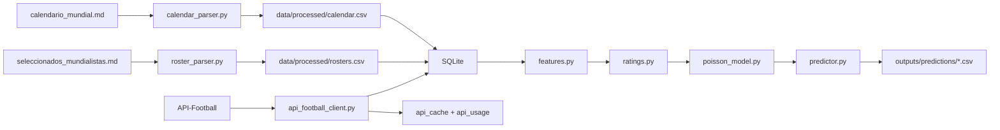
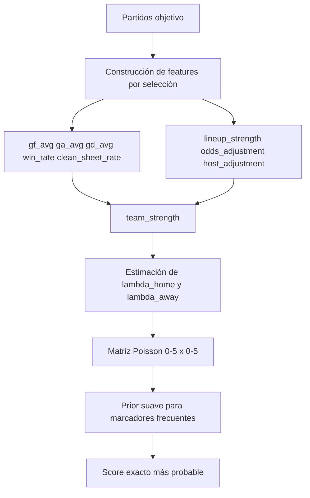

# quiniela-mundial-2026

Scaffold local-first en Python para predecir marcadores exactos del Mundial 2026. El proyecto combina una base SQLite, parsers de datos manuales, cache local para API-Football y un modelo Poisson simple para producir predicciones reproducibles, auditables y fáciles de extender.

No incluye dashboard. La prioridad es tener un pipeline funcional, simple y testeable.

## Qué resuelve

- Ingesta de calendario y convocados desde archivos Markdown locales.
- Normalización de nombres de selecciones y jugadores.
- Base de datos SQLite lista para operar offline.
- Cache local de respuestas API-Football.
- Backfill histórico por selección.
- Fetch del día de partido para metadata, alineaciones, estadísticas, eventos y odds.
- Features mínimas, rating interpretable y predicción de marcador exacto.
- Modo “publicable” para compartir el proyecto sin exponer API keys ni telemetría de consumo.

## Principios de diseño

- `local-first`: SQLite es la fuente operativa del proyecto.
- `live-on-miss`: primero se busca en cache; si falta, se consulta la API.
- `degraded-by-default`: si no hay API key o faltan datos, el pipeline sigue funcionando con defaults razonables.
- `inspectable`: todo lo importante queda en CSV, SQLite o logs Markdown.
- `publicable`: el repo puede compartirse sin secretos y con un bundle offline opcional.

## Arquitectura



## Flujo de predicción



## Estructura del repo

```text
.
├── data/
│   ├── raw/                  # fuentes manuales originales
│   ├── processed/            # calendar.csv y rosters.csv
│   ├── db/                   # SQLite operativa local
│   └── public/               # documentación del modo publicable
├── outputs/
│   ├── predictions/          # predicciones exportadas a CSV
│   ├── logs/                 # reportes de calidad y uso API
│   └── bundles/              # bundles offline para compartir
├── scripts/                  # wrappers 01..11
├── src/quiniela/             # librería principal
└── tests/                    # suite offline
```

## Requisitos

- Python `3.11+`
- Windows, macOS o Linux con `sqlite3` disponible
- API key de API-Football opcional

El proyecto no asume compatibilidad con Python `3.9.x`.

## Instalación

```bash
python -m venv .venv
.venv\Scripts\activate
python -m pip install --upgrade pip
pip install -r requirements.txt
copy .env.example .env
```

Variables de entorno:

- `API_FOOTBALL_KEY`: opcional; habilita llamadas en vivo.
- `API_FOOTBALL_HOST`: por defecto `v3.football.api-sports.io`.
- `API_DAILY_LIMIT`: por defecto `100`; para plan Pro ajústalo a `7500`.
- `DB_PATH`: por defecto `data/db/quiniela.db`.
- `LOCAL_TIMEZONE`: por defecto `America/Mexico_City`.

## Inicio rápido

1. Parsear fuentes manuales:

```bash
python scripts/01_ingest_calendar.py
python scripts/02_ingest_rosters.py
```

2. Inicializar base:

```bash
python scripts/03_init_db.py
```

3. Backfill histórico:

```bash
python scripts/04_fetch_priority_history.py --teams "México,Sudáfrica,República de Corea,República Checa"
```

4. Traer datos del día:

```bash
python scripts/05_fetch_today_data.py --date 2026-06-11
python scripts/05_fetch_today_data.py --date 2026-06-11 --lineups-only
```

5. Generar predicciones:

```bash
python scripts/06_predict_match.py --date 2026-06-11
python scripts/06_predict_match.py --home "México" --away "Sudáfrica"
```

6. Ver uso API:

```bash
python scripts/08_report_api_usage.py
```

## Cómo usa API-Football

El cliente `src/quiniela/api_football_client.py` encapsula un patrón `cache-first`:

1. Busca `endpoint + params` en `api_cache`.
2. Si existe cache, devuelve la respuesta y registra `cache_hit=1` en `api_usage`.
3. Si no existe cache, valida que haya API key y cuota diaria disponible.
4. Hace la request real, registra el consumo y persiste el payload JSON en SQLite.

Endpoints usados por el scaffold:

- `/teams`
- `/fixtures`
- `/fixtures/lineups`
- `/fixtures/statistics`
- `/fixtures/events`
- `/odds`

### Free vs Pro

Al 11 de junio de 2026, la página de pricing de API-Football indica:

- `Free`: `100` requests por día.
- `Pro`: `7,500` requests por día.
- Ambos planes incluyen los mismos endpoints; la diferencia importante es que el plan free está limitado por temporadas disponibles.

Eso cambia mucho el comportamiento práctico:

- `Free` suele servir para pruebas, fixtures del día, lineups y validaciones ligeras.
- `Pro` es el modo adecuado para hacer backfill histórico amplio sin pelear con la disponibilidad de temporadas.

Limitación importante de publicación:

- API-Football prohíbe revender directamente sus datos.
- Su ToS también dice que la licencia o permiso para publicar esos datos debe gestionarla el usuario.

Por eso este repo separa dos cosas:

- el código abierto del pipeline
- los bundles offline con datos derivados, que debes redistribuir sólo si tienes claro que tu uso cumple con las licencias aplicables

## Modo sin API key

Si `API_FOOTBALL_KEY` está vacía, el proyecto sigue funcionando para:

- parsear calendario y convocados
- crear SQLite
- construir features con defaults
- calcular ratings
- generar predicciones Poisson

Lo que queda degradado:

- backfill histórico en vivo
- alineaciones del día
- estadísticas, eventos y odds del día

## Algoritmo de predicción

El pipeline actual es deliberadamente simple.

### 1. Features por selección

Para cada partido se calcula una ventana reciente `N=5` con:

- `gf_avg`: goles a favor promedio
- `ga_avg`: goles en contra promedio
- `gd_avg`: diferencia promedio
- `win_rate`
- `clean_sheet_rate`
- `recent_form_score`
- `host_adjustment`
- `lineup_strength`
- `odds_adjustment`

Si falta histórico, se usan defaults neutros:

- `gf_avg=1.0`
- `ga_avg=1.0`
- `win_rate=0.33`
- `gd_avg=0.0`
- `recent_form_score=0.0`

Además se marca `used_fallback=1` para que la predicción siga siendo auditable.

### 2. Rating interpretable

`ratings.py` construye:

```text
team_strength =
    goal_difference_component
  + form_component
  + lineup_component
  + odds_component
  + host_component
```

Cada componente se recorta a bandas pequeñas para mantener estabilidad y evitar explosiones numéricas.

### 3. Lambdas de gol

`poisson_model.py` convierte features y strengths en dos intensidades:

```text
lambda_home = 1.10 + 0.35 * (home_gf - away_ga) + 0.30 * (home_strength - away_strength)
lambda_away = 1.00 + 0.35 * (away_gf - home_ga) + 0.30 * (away_strength - home_strength)
```

Luego ambas se recortan a `[0.2, 2.8]`.

### 4. Matriz de score exacto

Se calcula una matriz Poisson `0..5 x 0..5`, se aplica un prior ligero a marcadores frecuentes de Mundial:

- `0-0`
- `1-0`
- `1-1`
- `2-0`
- `2-1`

Finalmente se normaliza la matriz y se elige el score con mayor probabilidad.

## Base de datos

Tablas principales:

- `teams`
- `players`
- `matches`
- `historical_matches`
- `historical_lineups`
- `historical_team_stats`
- `historical_player_stats`
- `odds_snapshots`
- `predictions`
- `actual_results`
- `api_cache`
- `api_usage`

### Cómo inspeccionarla

Opciones recomendadas:

- `DB Browser for SQLite`: la opción más simple para explorar tablas y correr queries.
- `SQLiteStudio`: muy cómoda para filtros, índices y exportaciones.
- `VS Code + SQLite extension`: útil si ya trabajas dentro del editor.

Ejemplos rápidos:

```bash
sqlite3 data/db/quiniela.db ".tables"
sqlite3 data/db/quiniela.db "select home_team, away_team, api_fixture_id from matches where date_cdmx='2026-06-11';"
sqlite3 data/db/quiniela.db "select endpoint, count(*) from api_usage group by endpoint order by count(*) desc;"
```

## Modo publicable

El repo ya incluye un flujo para generar un bundle offline compartible sin secretos.

### Exportar bundle

```bash
python scripts/09_export_public_bundle.py
```

Eso crea:

- `outputs/bundles/public_bundle/quiniela_public.sqlite`
- `outputs/bundles/public_bundle/manifest.json`
- `outputs/bundles/public_bundle/processed/calendar.csv`
- `outputs/bundles/public_bundle/processed/rosters.csv`
- `outputs/bundles/quiniela_public_bundle.zip`

El bundle:

- conserva datos operativos para predicción
- elimina datos de `api_cache`
- elimina datos de `api_usage`
- no incluye API key

### Importar bundle

```bash
python scripts/10_import_public_bundle.py --bundle-path outputs/bundles/quiniela_public_bundle.zip
```

### Ver estado del bundle/base

```bash
python scripts/11_public_bundle_status.py
```

### Estrategia recomendada para publicar

Para un repo público seguro:

1. Publica el código, tests y documentación.
2. No publiques `.env`.
3. No publiques `api_cache` ni `api_usage`.
4. Evalúa con cuidado si puedes redistribuir un bundle con datos derivados de API-Football.
5. Si quieres compartir el bundle, hazlo como release asset o distribución privada sólo si tu uso/licencia lo permite.

## Qué sí puede hacer un usuario del plan free

En general:

- correr el pipeline offline con los datos manuales
- usar la API para comprobaciones ligeras
- traer algunos fixtures del día
- intentar traer lineups del día

En la práctica, la disponibilidad exacta depende de:

- la cobertura del partido en API-Football
- la temporada habilitada en el plan free
- la cuota diaria restante

Así que sí, el plan free puede servir para lineups del día en algunos escenarios, pero no es una base confiable para backfill histórico masivo.

## Pruebas

```bash
pytest -q
```

La suite base es offline y no consume cuota real.

## Publicación en GitHub sin exponer secretos

Checklist mínima:

1. Mantén `.env` fuera del repo.
2. Revisa `.gitignore` antes de hacer el primer push.
3. Usa `.env.example` como plantilla pública.
4. No subas dumps con credenciales, cache o logs sensibles.
5. Si haces un release con datos, documenta su origen, fecha de corte y limitaciones legales.

Comandos locales típicos:

```bash
git init -b main
git add .
git commit -m "Initial public scaffold"
git remote add origin https://github.com/TU_USUARIO/quiniela-mundial-2026.git
git push -u origin main
```

## Estado actual del scaffold

Incluye:

- parsers de calendario y convocados
- normalización de nombres
- SQLite + schema idempotente
- cache local de API-Football
- backfill histórico por selección
- fetch del día
- features mínimas
- rating interpretable
- modelo Poisson
- CLI con wrappers `01..11`
- bundle offline para modo publicable

No incluye:

- dashboard
- entrenamiento ML complejo
- scheduler de producción
- integración CI/CD todavía
