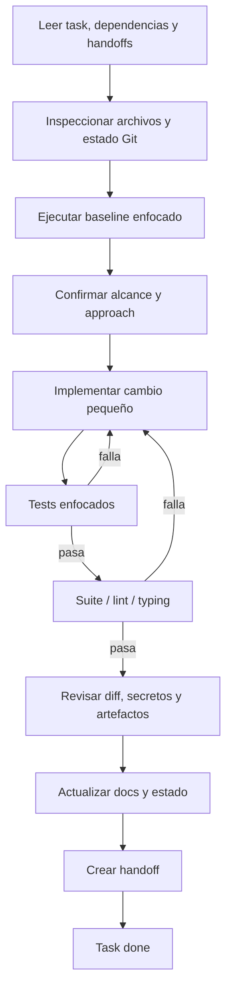
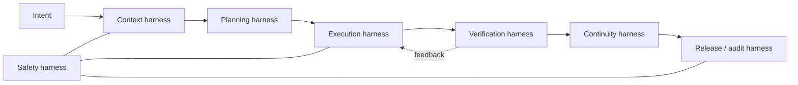
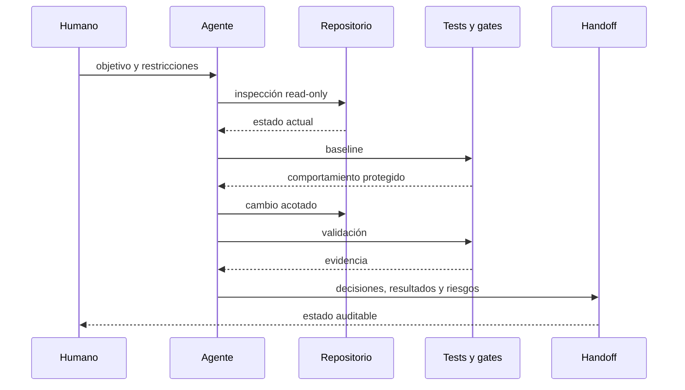

# Guía de Solidificación y Harness Engineering

## Propósito

Este documento explica cómo Quiniela Mundial 2026 pasó de un MVP funcional a
una V1 solidificada mediante una epic incremental, auditable y preparada para
trabajo con agentes de IA.

Tiene dos objetivos:

1. reconstruir el proceso real aplicado en este repositorio;
2. extraer un playbook reusable para otros proyectos.

No sustituye los documentos de arquitectura, contratos ni runbooks. Los conecta
y explica por qué existen, cómo se usaron y cómo forman un sistema de control
para humanos y agentes.

## Contenido

- [Parte I: caso de estudio](#parte-i-caso-de-estudio)
- [Estado inicial](#estado-inicial)
- [Objetivos de la solidificación](#objetivos-de-la-solidificación)
- [Cadena de evidencia](#cadena-de-evidencia)
- [Tasks y handoffs](#tasks-y-handoffs)
- [Mapa TASK-000 a TASK-041](#mapa-task-000-a-task-041)
- [Flujo de ejecución de una task](#flujo-de-ejecución-de-una-task)
- [Integración de agentes de IA](#integración-de-agentes-de-ia)
- [Auditoría y Definition of Done](#auditoría-y-definition-of-done)
- [Lecciones y hardening](#lecciones-y-hardening)
- [Parte II: playbook reusable](#parte-ii-playbook-reusable)
- [Qué es harness engineering](#qué-es-harness-engineering)
- [Componentes del harness](#componentes-del-harness)
- [Cómo replicarlo](#cómo-replicarlo)
- [Plantillas](#plantillas)
- [Anti-patrones](#anti-patrones)

# Parte I: caso de estudio

## Estado inicial

El MVP ya resolvía el problema principal:

- ingestaba calendario y convocatorias;
- mantenía una base SQLite;
- consultaba API-Football;
- calculaba predicciones Poisson y Logit;
- incorporaba evidencia de jugadores;
- generaba outputs;
- automatizaba matchday;
- enviaba notificaciones.

La suite inicial estaba verde con 80 tests. El riesgo no era que el producto no
funcionara, sino que cada cambio futuro aumentaba el acoplamiento.

### Riesgos observados

- `db.py` concentraba schema, migraciones, cache, predicciones, automation,
  snapshots y releases.
- CLI, loaders y workflows mezclaban composición, aplicación e infraestructura.
- SQLite, HTTP, filesystem y reloj aparecían directamente en lógica funcional.
- No existían paquetes `domain`, `application`, `ports`, `adapters` ni
  `infrastructure`.
- El dominio estaba implícito en DataFrames, dicts, strings e SQL.
- No había guardrails de layering.
- Ruff, mypy, coverage y pre-commit no estaban normalizados.
- La portabilidad multi-torneo era una intención, no un contrato operativo.
- La continuidad entre sesiones dependía demasiado del contexto conversacional.
- El entorno observado usaba Python 3.9.7 aunque el proyecto declaraba 3.11+.

La auditoría completa quedó en
[Architecture Audit](ARCHITECTURE_AUDIT.md).

## Objetivos de la solidificación

La epic no buscó una reescritura total. Buscó:

- introducir arquitectura hexagonal sin romper el flujo existente;
- hacer explícitos dominio, puertos, adapters y casos de uso;
- proteger contratos mediante tests;
- formalizar API resilience, odds-aware y aprendizaje controlado;
- aislar competencia y temporada;
- fortalecer notificaciones y outputs auditables;
- hacer reproducible el entorno local;
- crear continuidad durable para trabajo agéntico;
- cerrar con evidencia, riesgos y rollback.

### Principios no negociables

1. El comportamiento verde debía seguir verde.
2. Los scripts y CLI existentes eran interfaz pública.
3. Las migraciones de DB serían aditivas y compatibles.
4. Cada task tendría alcance, dependencias, tests y rollback.
5. Ningún agente dependería sólo de memoria conversacional.
6. Operaciones live requerirían aprobación explícita.
7. Handoffs y comandos permitirían auditar cada paso.

## Cadena de evidencia

```mermaid
flowchart LR
    Handoff[Plan maestro]
    Backlog[Backlog ejecutable]
    Audit[Auditoría read-only]
    Target[Arquitectura objetivo]
    Plan[Plan incremental]
    Task[Task acotada]
    Baseline[Baseline de tests]
    Change[Cambio]
    Gates[Quality gates]
    Evidence[Handoff]
    Final[Auditoría final]

    Handoff --> Backlog
    Backlog --> Audit
    Audit --> Target
    Target --> Plan
    Plan --> Task
    Task --> Baseline
    Baseline --> Change
    Change --> Gates
    Gates --> Evidence
    Evidence --> Task
    Evidence --> Final
```



### Fuentes de evidencia

| Fuente | Función |
| --- | --- |
| Plan maestro local | Intención y restricciones de la epic. |
| Backlog local de solidificación | Orden, criterios y validaciones de ejecución. |
| `docs/ARCHITECTURE_AUDIT.md` | Fotografía factual del MVP. |
| `docs/ARCHITECTURE_TARGET.md` | Dirección arquitectónica. |
| `docs/HEXAGONAL_MIGRATION_PLAN.md` | Secuencia reversible de extracción. |
| `docs/handoffs/TASK-XXX.md` | Evidencia real de cada ejecución. |
| tests y comandos | Prueba ejecutable de comportamiento. |
| `docs/SOLIDIFICATION_V1_FINAL_REPORT.md` | Auditoría global y cierre. |

### Regla de autoridad

Cuando dos fuentes discrepan:

1. instrucciones actuales;
2. estado real del repositorio;
3. tests y comandos;
4. handoff más reciente;
5. backlog;
6. memoria externa.

Esta jerarquía evitó que estados stale del backlog o recuerdos de sesiones
anteriores dominaran la realidad.

## Tasks y handoffs

### Por qué usar tasks pequeñas

Una task debía poder:

- ser entendida sin cargar toda la epic;
- modificar una superficie limitada;
- tener dependencias explícitas;
- ejecutarse con baseline enfocado;
- producir un resultado verificable;
- revertirse sin deshacer el hito completo;
- transferirse a otro agente.

Las tasks pequeñas también permitieron elegir profundidad de razonamiento según
riesgo. Auditoría, arquitectura, multi-torneo y cierre requerían revisión
crítica; tooling o adapters pequeños podían implementarse con un agente más
económico.

### Anatomía de una task

Cada task definía:

- objetivo;
- contexto;
- alcance incluido;
- fuera de alcance;
- dependencias;
- archivos a inspeccionar;
- archivos probablemente afectados;
- pasos sugeridos;
- criterios de aceptación;
- comandos de validación;
- riesgos;
- rollback;
- handoff requerido.

El backlog era un contrato de ejecución, no una lista informal de deseos.

### Por qué usar handoffs

El handoff cumple cuatro funciones:

1. **memoria durable:** permite continuar sin conversación anterior;
2. **evidencia:** registra qué se hizo y qué se validó;
3. **control de alcance:** declara qué quedó fuera;
4. **recuperación:** contiene próximos pasos y rollback.

Un handoff no es un resumen de ánimo ni un log completo. Debe incluir decisiones,
comandos exactos, resultados resumidos, errores, riesgos y seguridad.

La plantilla oficial está en
[Handoff Template](handoffs/HANDOFF_TEMPLATE.md).

## Mapa TASK-000 a TASK-041

### Fase 0: reconocimiento y continuidad

| Task | Propósito | Dependencia | Entregable | Evidencia |
| --- | --- | --- | --- | --- |
| 000 | Convertir el plan maestro en backlog y reglas de continuidad. | Plan original | Backlog y template | `TASK-000-PLAN.md` |
| 001 | Auditar módulos, scripts, DB, tests y acoplamientos sin cambiar código. | 000 | Architecture audit | `TASK-001.md` |
| 002 | Definir mapa de dependencias y límites temporales. | 001 | Dependency map | `TASK-002.md` |

### Fase 1: documentación base

| Task | Propósito | Dependencia | Entregable | Evidencia |
| --- | --- | --- | --- | --- |
| 003 | Diseñar arquitectura objetivo hexagonal. | 001-002 | Architecture target | `TASK-003.md` |
| 004 | Diseñar migración incremental y reversible. | 003 | Migration plan | `TASK-004.md` |
| 005 | Formalizar continuidad agent-safe. | 004 | Handoff template | `TASK-005.md` |
| 006 | Definir estándares y quality gates graduales. | 001-005 | Coding/testing docs | `TASK-006.md` |
| 007 | Diseñar state machine y taxonomía de errores. | 003 | Contratos de estado/error | `TASK-007.md` |
| 008 | Diseñar resiliencia, caché y cuota API. | 001-007 | API policy | `TASK-008.md` |
| 009 | Formalizar odds-aware y overround. | 003 | Odds design | `TASK-009.md` |
| 010 | Diseñar portabilidad multi-torneo. | 003 | Multi-tournament design | `TASK-010.md` |
| 011 | Crear runbooks, contratos y documentos operativos. | 005-010 | Docs base | `TASK-011.md` |

### Fase 2: tooling

| Task | Propósito | Dependencia | Entregable | Evidencia |
| --- | --- | --- | --- | --- |
| 012 | Activar Ruff sin reformateo masivo. | 006 | Config lint | `TASK-012.md` |
| 013 | Activar mypy de forma gradual. | 006,012 | Config typing | `TASK-013.md` |
| 014 | Añadir coverage y pre-commit informativos. | 006,012-013 | Quality harness | `TASK-014.md` |

### Fase 3: esqueleto hexagonal

| Task | Propósito | Dependencia | Entregable | Evidencia |
| --- | --- | --- | --- | --- |
| 015 | Crear paquetes hexagonales compatibles. | 003-006 | Skeleton | `TASK-015.md` |
| 016 | Introducir errores y value objects mínimos. | 007,015 | Domain primitives | `TASK-016.md` |
| 017 | Introducir Clock y repositorios como ports. | 015-016 | Protocols | `TASK-017.md` |

### Fase 4: extracción SQLite

| Task | Propósito | Dependencia | Entregable | Evidencia |
| --- | --- | --- | --- | --- |
| 018 | Extraer conexión y migraciones compatibles. | 017 | SQLite adapter base | `TASK-018.md` |
| 019 | Extraer MatchRepository inicial. | 018 | Match adapter | `TASK-019.md` |
| 020 | Extraer prediction y snapshot repositories. | 018-019 | Repositories | `TASK-020.md` |

### Fase 5: casos de uso

| Task | Propósito | Dependencia | Entregable | Evidencia |
| --- | --- | --- | --- | --- |
| 021 | Crear GeneratePredictionUseCase facade. | 020 | Use case | `TASK-021.md` |
| 022 | Crear RefreshMatchdayUseCase facade. | 021 | Workflow use case | `TASK-022.md` |

### Fase 7: API resiliente

| Task | Propósito | Dependencia | Entregable | Evidencia |
| --- | --- | --- | --- | --- |
| 023 | Crear FootballDataProvider y adapter. | 017,022 | Provider port/adapter | `TASK-023.md` |
| 024 | Implementar policies runtime. | 008,023 | Rate/budget/circuit policies | `TASK-024.md` |

### Fase 8: doctor y operación

| Task | Propósito | Dependencia | Entregable | Evidencia |
| --- | --- | --- | --- | --- |
| 025 | Implementar doctor read-only con tres formatos. | 011,022 | Doctor CLI | `TASK-025.md` |

### Fase 9: predicción auditable

| Task | Propósito | Dependencia | Entregable | Evidencia |
| --- | --- | --- | --- | --- |
| 026 | Añadir campos y razones auditables sin romper exports. | 020-025 | Prediction contract | `TASK-026.md` |

### Fase 10: odds formal

| Task | Propósito | Dependencia | Entregable | Evidencia |
| --- | --- | --- | --- | --- |
| 027 | Crear dominio, port y repository de odds. | 009,017-020 | Odds contracts | `TASK-027.md` |
| 028 | Extraer BuildOddsConsensusUseCase. | 027 | Use case | `TASK-028.md` |

### Fase 11: ensemble

| Task | Propósito | Dependencia | Entregable | Evidencia |
| --- | --- | --- | --- | --- |
| 029 | Formalizar ensemble y pesos auditables. | 009,026-028 | Ensemble contract | `TASK-029.md` |

### Fase 12: multi-torneo

| Task | Propósito | Dependencia | Entregable | Evidencia |
| --- | --- | --- | --- | --- |
| 030 | Añadir configuraciones declarativas. | 010,015 | YAML configs/context | `TASK-030.md` |
| 031 | Migrar DB a competition/season. | 030 | Schema compatible | `TASK-031.md` |

### Fase 13: aprendizaje controlado

| Task | Propósito | Dependencia | Entregable | Evidencia |
| --- | --- | --- | --- | --- |
| 032 | Formalizar model cards, gates y releases. | 009-011,026,031 | Learning policy | `TASK-032.md` |

### Fase 14: notificaciones

| Task | Propósito | Dependencia | Entregable | Evidencia |
| --- | --- | --- | --- | --- |
| 033 | Fortalecer outbox, dedupe, retry y comandos ops. | 025-032 | Robust notifications | `TASK-033.md` |

### Fase 15: outputs

| Task | Propósito | Dependencia | Entregable | Evidencia |
| --- | --- | --- | --- | --- |
| 034 | Añadir namespace y auditoría humana. | 026,029-033 | Auditable outputs | `TASK-034.md` |

### Fase 16: agentes y migración

| Task | Propósito | Dependencia | Entregable | Evidencia |
| --- | --- | --- | --- | --- |
| 035 | Crear guía end-to-end para migrar torneo con agentes. | 030-034 | Agent migration guide | `TASK-035.md` |

### Fase 17: hardening y cierre inicial

| Task | Propósito | Dependencia | Entregable | Evidencia |
| --- | --- | --- | --- | --- |
| 036 | Proteger dirección de imports con AST. | 015-035 | Layering tests | `TASK-036.md` |
| 037 | Auditar Definition of Done y riesgos. | 000-036 | Final report | `TASK-037.md` |

### Fases 18-20: auditoría posterior y readiness

| Task | Propósito | Dependencia | Entregable | Evidencia |
| --- | --- | --- | --- | --- |
| 038 | Eliminar excepciones SQLite de application. | 025,028,036 | Ports/adapters finales | `TASK-038.md` |
| 039 | Propagar selector real de competencia. | 030-035,037 | Multi-competition ops | `TASK-039.md` |
| 040 | Normalizar Python 3.11 y editable install. | 037 | Entorno reproducible | `TASK-040.md` |
| 041 | Definir política de artefactos y publicación. | 037,040 | Release preflight | `TASK-041.md` |

> Los números de fase siguen el backlog original. La ausencia de una Fase 6
> técnica separada refleja que state machine y errores se resolvieron primero
> como diseño y contratos, antes de los refactors posteriores.

## Flujo de ejecución de una task



### 1. Lectura

- leer la definición completa;
- comprobar dependencias por handoff;
- leer documentos y módulos indicados;
- revisar el reporte final si existe.

### 2. Inspección

- `git status --short`;
- búsqueda de símbolos y consumers;
- lectura de tests existentes;
- identificación de cambios previos del usuario;
- verificación de riesgos live.

### 3. Baseline

Antes del cambio:

- ejecutar tests enfocados;
- registrar fallos preexistentes;
- añadir characterization test si falta cobertura;
- no confundir deuda previa con regresión nueva.

### 4. Implementación

- respetar patrones existentes;
- cambiar el mínimo número de fronteras;
- conservar defaults y aliases;
- evitar refactors oportunistas;
- introducir ports antes de adapters concretos;
- mantener facades cuando reducen riesgo.

### 5. Verificación

Capas de verificación:

1. tests unitarios o enfocados;
2. tests de integración temporal;
3. tests de arquitectura;
4. suite completa;
5. Ruff y mypy;
6. CLI `--help`;
7. `git diff --check`;
8. auditoría de secretos y artefactos cuando aplica.

### 6. Cierre

El handoff registra:

- objetivo y alcance;
- contexto leído;
- cambios;
- archivos;
- decisiones;
- validaciones;
- riesgos;
- errores y resolución;
- próximo paso;
- recuperación;
- seguridad;
- rollback.

## Integración de agentes de IA

### Modelo de colaboración

El agente actúa como implementador o reviewer dentro de un sistema de
restricciones. No decide unilateralmente el objetivo de producto ni reemplaza
la evidencia ejecutable.

### Separación de autoridad

- El usuario define el objetivo y aprueba efectos externos.
- El backlog define el contrato de la task.
- El repositorio define el estado actual.
- Los tests definen comportamiento protegido.
- El agente propone o ejecuta cambios dentro del alcance.
- El handoff permite que otro agente audite y continúe.

### Memoria externa

`agent-memory-server` se utilizó cuando estuvo disponible, pero nunca fue una
dependencia de continuidad.

Regla:

> Memory suggests. Current repository state confirms.

Esto evitó que fallos de infraestructura de memoria bloquearan la epic.

### Permisos y operaciones live

| Operación | Política |
| --- | --- |
| Leer código/docs | Permitido. |
| Ejecutar suite offline | Permitido. |
| Crear DB temporal | Permitido. |
| Instalar runtime/dependencias | Requiere aprobación cuando usa red. |
| Consultar API live | Requiere aprobación y control de cuota. |
| Enviar ntfy/Discord | Requiere aprobación explícita. |
| Modificar Task Scheduler | Dry-run primero; instalación consciente. |
| Borrar DB/outputs | No hacerlo sin confirmación humana. |

### Selección de agentes/modelos

La epic clasificó tasks:

- **revisión crítica:** auditoría, arquitectura, contratos, multi-torneo,
  seguridad y cierre;
- **implementación acotada:** tooling, adapters pequeños, docs operativas;
- **reviewer:** policy de publicación y auditoría final.

El principio reusable es asignar capacidad según riesgo, no según longitud del
archivo.

### Revisión humana

La aprobación humana es necesaria para:

- cambios de producto ambiguos;
- secretos;
- red y cuotas;
- publicación de datos;
- migraciones destructivas;
- activación de modelos;
- notificaciones reales;
- commits y releases.

## Auditoría y Definition of Done

### Auditoría por task

Una task está completa cuando:

- sus dependencias están satisfechas;
- los criterios de aceptación son observables;
- los comandos requeridos pasan;
- no hay cambios fuera de alcance;
- docs y estado están sincronizados;
- existe handoff;
- riesgos y rollback están explícitos.

### Auditoría de epic

La auditoría final comprobó:

- presencia de handoffs;
- estado real del backlog;
- paquetes y contratos creados;
- tests, lint y typing;
- compatibilidad CLI;
- entorno Python;
- aislamiento multi-competencia;
- política de outputs;
- ausencia de secretos publicados;
- riesgos residuales.

### Definition of Done utilizada

- backlog completo;
- suite offline verde;
- quality gates verdes;
- handoffs recuperables;
- reporte final;
- rollback documentado;
- no secretos ni DB privadas;
- artefactos generados fuera de Git;
- siguiente trabajo separado de la V1.

## Lecciones y hardening

### 1. Cerrar no significa dejar de auditar

TASK-037 produjo un cierre inicial. La auditoría posterior detectó cuatro
pendientes:

- imports SQLite en application;
- selector multi-competencia incompleto;
- entorno Python inconsistente;
- política de outputs indefinida.

Se crearon TASK-038 a TASK-041 y se reabrió el cierre de manera controlada.

### 2. El estado declarado puede adelantarse a la implementación

TASK-038 figuró `done` antes de tener handoff y antes de eliminar la allowlist.
La solución fue verificar criterios y código, no confiar en la etiqueta.

### 3. Compatibilidad requiere pruebas de integración

Al propagar `CompetitionContext` aparecieron dobles legacy con firmas antiguas y
bundles de schema parcial. Se conservaron mediante introspección y tests.

### 4. Reproducibilidad también es arquitectura

Python 3.9 frente a un proyecto 3.11 impedía validar el entrypoint real. TASK-040
normalizó runtime, `.venv` e instalación editable.

### 5. Un artefacto sanitizado no resuelve licencias

TASK-041 distinguió:

- secreto;
- dato privado;
- dato derivado;
- permiso de redistribución.

`outputs/` y bundles quedaron fuera del repo aunque el bundle elimine secretos.

# Parte II: playbook reusable

## Qué es harness engineering

En esta guía, **harness engineering** es el diseño del sistema que rodea a un
agente o equipo para convertir intención en cambios confiables.

El harness no es sólo una herramienta. Es la combinación de:

- contexto;
- contratos;
- restricciones;
- permisos;
- herramientas;
- feedback ejecutable;
- evidencia;
- recuperación;
- auditoría.

Un buen harness reduce decisiones implícitas, detecta desviaciones temprano y
permite que otra persona reproduzca el trabajo.



## Componentes del harness

### Context harness

Responde: **¿qué debe conocer el agente antes de actuar?**

Incluye:

- README y docs;
- mapa de módulos;
- arquitectura actual y objetivo;
- contratos de datos;
- estado Git;
- tests existentes;
- decisiones activas;
- restricciones del entorno.

Aplicación en este proyecto:

- Architecture Audit;
- Architecture Target;
- Decision Log;
- Data Contracts;
- handoffs y reporte final.

### Planning harness

Responde: **¿cómo se divide la intención en trabajo ejecutable?**

Incluye:

- backlog ordenado;
- dependencias;
- prioridades;
- alcance/fuera de alcance;
- archivos a inspeccionar;
- criterios de aceptación;
- rollback.

Aplicación:

- plan maestro;
- TASK-000 a TASK-041;
- fases de documentación, tooling, extracción y hardening.

### Execution harness

Responde: **¿cómo debe realizarse el cambio?**

Incluye:

- reglas de capas;
- comandos oficiales;
- patrones del repositorio;
- composition roots;
- facades compatibles;
- límites de mutación;
- tamaño recomendado de cambio.

Aplicación:

- Coding Standards;
- Hexagonal Migration Plan;
- adapters y use cases pequeños;
- scripts preservados como frontera.

### Verification harness

Responde: **¿cómo sabemos que el cambio funciona?**

Incluye:

- tests enfocados;
- suite completa;
- lint;
- typing;
- tests de arquitectura;
- CLI smoke tests;
- checks de diff;
- auditorías de artefactos.

Aplicación:

- Pytest;
- Ruff;
- mypy;
- pre-commit;
- AST layering tests;
- doctor CLI.

### Safety harness

Responde: **¿qué no debe hacer el agente sin aprobación?**

Incluye:

- política de secretos;
- permisos de red;
- límites de cuota;
- operaciones destructivas;
- notificaciones reales;
- publicación de datos;
- separación offline/live.

Aplicación:

- API Policy;
- runbooks;
- configs ejemplo deshabilitadas;
- `.gitignore`;
- TASK-041.

### Continuity harness

Responde: **¿cómo continúa el trabajo si cambia el agente o se pierde contexto?**

Incluye:

- handoff estructurado;
- comandos de recuperación;
- estado y riesgos;
- próximos pasos;
- decisiones durables;
- memoria externa advisory.

Aplicación:

- `docs/handoffs/`;
- HANDOFF_TEMPLATE;
- agent-memory-server como apoyo;
- repositorio como autoridad.

### Release/audit harness

Responde: **¿cómo se decide que una epic está lista?**

Incluye:

- Definition of Done;
- reporte final;
- inventario de cambios;
- política de artefactos;
- seguridad;
- rollback global;
- aprobación humana.

Aplicación:

- TASK-037;
- TASK-038 a TASK-041;
- Solidification V1 Final Report.

## Flujo de evidencia reusable



## Cómo replicarlo

### Paso 1: establecer baseline

Inventaria:

- estructura;
- entrypoints;
- dependencias;
- persistencia;
- sistemas externos;
- tests;
- entorno;
- riesgos de seguridad.

No diseñes todavía. Describe la realidad.

### Paso 2: definir arquitectura objetivo

Documenta:

- capas;
- dirección de dependencias;
- contratos;
- ownership;
- compatibilidad temporal;
- decisiones que requieren ADR.

La arquitectura objetivo debe ser suficientemente concreta para guiar, pero no
debe obligar a una reescritura inmediata.

### Paso 3: diseñar migración incremental

Orden recomendado:

1. docs y baseline;
2. quality gates;
3. skeleton;
4. value objects;
5. ports;
6. adapters pequeños;
7. use case facades;
8. migraciones compatibles;
9. operación;
10. hardening y cierre.

### Paso 4: convertir etapas en tasks

Cada task debe:

- caber en una sesión razonable;
- tener una única razón de cambio;
- declarar dependencias;
- incluir un baseline;
- tener rollback;
- producir handoff.

### Paso 5: crear feedback rápido

Para cada superficie define:

- test enfocado;
- integración mínima;
- suite amplia;
- quality gates;
- comando operativo de smoke.

No esperes al final de la epic para introducir feedback.

### Paso 6: separar safe y live

Clasifica comandos:

- lectura;
- tests offline;
- escritura local;
- migración;
- red;
- notificación;
- publicación;
- destrucción.

Asocia aprobación y rollback a cada categoría.

### Paso 7: cerrar cada task con evidencia

El handoff debe ser suficiente para que otro agente:

- entienda el objetivo;
- vea qué cambió;
- reproduzca validaciones;
- conozca riesgos;
- continúe sin preguntar lo obvio.

### Paso 8: auditar la epic

Compara:

- intención original;
- backlog;
- handoffs;
- código;
- tests;
- estado Git;
- artefactos;
- riesgos.

Si aparecen pendientes reales, crea tasks de hardening. No maquilles el cierre.

## Plantillas

### Plantilla de epic

```markdown
# Epic: <nombre>

## Resultado esperado
## Estado inicial y baseline
## Principios no negociables
## Arquitectura objetivo
## Fases
## Permisos y seguridad
## Definition of Done
## Política de handoffs
## Rollback global
```

### Plantilla de task

```markdown
## TASK-XXX - <título>

**Prioridad:** P0 | P1 | P2
**Fase:** <fase>
**Tipo:** docs | audit | refactor | feature | test | migration | ops
**Estado:** todo

### Objetivo
### Contexto
### Alcance incluido
### Fuera de alcance
### Dependencias
### Archivos a inspeccionar
### Archivos probablemente afectados
### Pasos sugeridos
### Criterios de aceptación
### Comandos de validación
### Riesgos
### Rollback
### Handoff requerido
```

### Plantilla de handoff mínimo

```markdown
# Handoff - TASK-XXX

## Objetivo y alcance
## Contexto leído
## Cambios realizados
## Archivos modificados
## Decisiones
## Validaciones y resultados
## Riesgos
## Errores y resolución
## Próximo paso
## Recuperación
## Seguridad
## Rollback
```

### Matriz de dependencias

| Task | Depende de | Bloquea | Superficie | Gate principal |
| --- | --- | --- | --- | --- |
| XXX | YYY | ZZZ | DB/API/UI | comando |

### Matriz de quality gates

| Superficie | Test enfocado | Integración | Gate amplio | Smoke operativo |
| --- | --- | --- | --- | --- |
| Dominio | unit test | N/A | suite | N/A |
| Persistencia | DB temporal | migration test | suite | doctor |
| API | fake provider | cache/policy | suite | `--dry-run` |
| CLI | runner | composition | suite | `--help` |
| Outputs | temp paths | rebuild | suite | file existence |

### Auditoría final

```markdown
## Tasks cerradas y evidencia
## Cambios por subsistema
## Validaciones
## Estado Git y artefactos
## Seguridad y licencias
## Riesgos residuales
## Rollback global
## Definition of Done
## Próximos pasos
```

### Rollback por cambio

```markdown
**Cambio:** <qué se introdujo>
**Señal de rollback:** <qué fallo lo activa>
**Acción:** <qué revertir o restaurar>
**Datos:** <backup/migración necesaria>
**Validación posterior:** <comandos>
```

## Anti-patrones

### Task gigante

**Síntoma:** mueve DB, API, CLI y outputs en una sola sesión.

**Problema:** blast radius alto, tests lentos, rollback ambiguo.

**Alternativa:** extraer contratos y adapters por superficie.

### Arquitectura aspiracional sin auditoría

**Síntoma:** el plan asume módulos o límites inexistentes.

**Problema:** se diseña contra una versión imaginaria del repo.

**Alternativa:** auditoría read-only antes de arquitectura objetivo.

### Memoria conversacional como autoridad

**Síntoma:** decisiones críticas sólo existen en chat.

**Problema:** se pierden entre sesiones y no son auditables.

**Alternativa:** handoffs, decision log, tests y docs.

### Tests sólo al final

**Síntoma:** se implementan muchas tasks antes de correr suite.

**Problema:** no se sabe qué cambio introdujo la regresión.

**Alternativa:** baseline, test enfocado y suite por task.

### Handoff narrativo sin evidencia

**Síntoma:** “todo funciona” sin comandos ni resultados.

**Problema:** el siguiente agente no puede verificar.

**Alternativa:** comandos exactos, resumen de resultados y riesgos.

### Cambios live sin aprobación

**Síntoma:** API, notificaciones o publicación durante tests.

**Problema:** consumo, filtración o efectos irreversibles.

**Alternativa:** dry-run, fakes, sandbox y aprobación explícita.

### Refactor masivo por pureza

**Síntoma:** eliminar todo legacy antes de tener contratos equivalentes.

**Problema:** rompe interfaces y eleva riesgo.

**Alternativa:** facades temporales y migración incremental.

### Documentación duplicada

**Síntoma:** el mismo contrato completo aparece en README, runbook y diseño.

**Problema:** las copias divergen.

**Alternativa:** README autosuficiente para uso y enlaces a documentos
canónicos para detalle normativo.

### Cierre sin auditoría posterior

**Síntoma:** se marca la epic completa porque la suite pasa.

**Problema:** pueden quedar deuda de capas, entorno o publicación.

**Alternativa:** comparar plan, handoffs, código, artifacts y Definition of Done.

## Checklist para otra epic

### Antes

- [ ] Objetivo y audiencia claros.
- [ ] Baseline reproducible.
- [ ] Inventario de módulos y sistemas externos.
- [ ] Arquitectura actual documentada.
- [ ] Riesgos y permisos clasificados.

### Durante

- [ ] Tasks pequeñas y dependientes.
- [ ] Handoff por task.
- [ ] Tests enfocados antes/después.
- [ ] Suite y quality gates.
- [ ] No efectos live no aprobados.
- [ ] Decisiones transversales registradas.

### Cierre

- [ ] Backlog y handoffs consistentes.
- [ ] Reporte final.
- [ ] Estado Git entendido.
- [ ] Secretos y artefactos auditados.
- [ ] Rollback global.
- [ ] Riesgos residuales con owner/próximo paso.
- [ ] Entorno y onboarding reproducibles.

## Documentos relacionados

- [README V1](../README.md)
- [Architecture Audit](ARCHITECTURE_AUDIT.md)
- [Architecture Target](ARCHITECTURE_TARGET.md)
- [Hexagonal Migration Plan](HEXAGONAL_MIGRATION_PLAN.md)
- [Testing Strategy](TESTING_STRATEGY.md)
- [Coding Standards](CODING_STANDARDS.md)
- [Agent Tournament Migration](AGENT_TOURNAMENT_MIGRATION.md)
- [Solidification V1 Final Report](SOLIDIFICATION_V1_FINAL_REPORT.md)
- [Handoff Template](handoffs/HANDOFF_TEMPLATE.md)

## Conclusión

La solidificación no fue un refactor aislado. Fue la construcción de un sistema
de ingeniería alrededor del producto: contexto, límites, feedback, seguridad,
continuidad y auditoría.

Ese sistema es el harness. Gracias a él, múltiples agentes y humanos pudieron
trabajar sobre un código existente, mantener compatibilidad, detectar deuda
residual y cerrar la V1 con evidencia reproducible.
